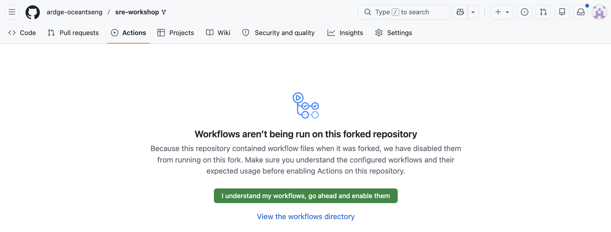
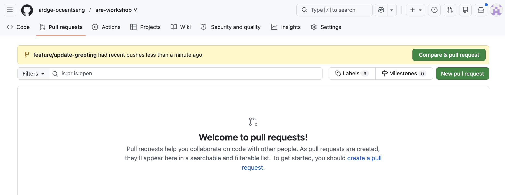
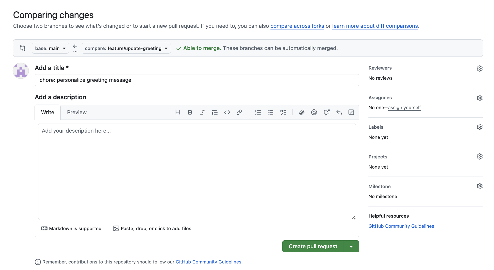
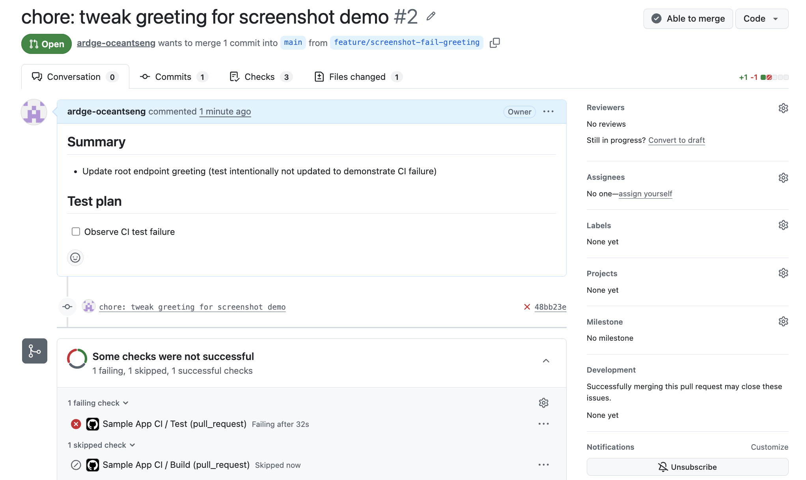
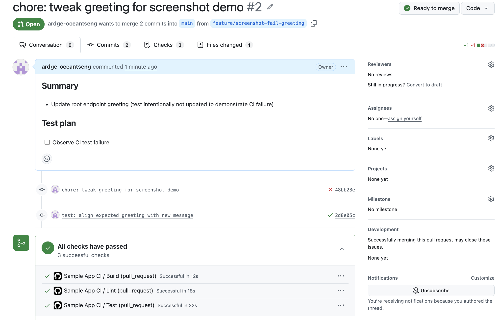

# 練習二：PR 檢查練習

> **難度：** 中級 | **對應章節：** [03 — Go 專案 CI Pipeline](../03-go-ci-pipeline.md)

## 練習：PR 檢查練習

### 目標

實際走一遍完整的 **PR 檢查流程**：建立分支、做一個小改動、開 PR、觀察 CI 結果。重點不在程式碼有多複雜，而在感受「push → CI → review → merge」這條動線。

### 要求

1. 從 `main` 建立一個新的分支 `feature/update-greeting`
2. 把 `/` endpoint 的歡迎訊息改成你想要的字串，並同步更新對應的 test
3. 開一個 PR，觀察 CI 檢查跑起來、變綠之後合併

### Step by Step 引導

#### 前置：Fork workshop repo

你們對 SRE Workshop repo 沒有寫入權限，所以要先 fork 一份到自己帳號下，後續所有 push、PR 都在你的 fork 內進行。

1. 到 SRE Workshop repo 頁面，右上角按 **Fork**

   

2. 把 fork 到自己帳號下的 repo Clone 下來：

   ```bash
   git clone git@github.com:<你的-username>/sre-workshop.git
   cd sre-workshop/CI-CD/examples/sample-app
   ```

3. 到 fork 頁面的 **Actions** 分頁，按 **I understand my workflows, go ahead and enable them** 啟用 workflow

   

   > GitHub 預設會把 fork 的 workflow 停掉，避免你在不知情的情況下幫上游跑 CI。沒按這顆綠色按鈕的話，後面 push 上去 PR 不會出現任何 check。

#### Step 1：建立新分支

```bash
git checkout main
git pull origin main
git checkout -b feature/update-greeting
```

#### Step 2：改歡迎訊息

打開 `CI-CD/examples/sample-app/handler.go`，把 `handleRoot` 裡的字串換成你想要的內容：

```go
// before
if _, err := w.Write([]byte("Hello, GitHub Actions!")); err != nil {

// after
if _, err := w.Write([]byte("Hello from <你的名字>!")); err != nil {
```

#### Step 3：Commit、Push、PR

```bash
git add handler.go
git commit -m "chore: personalize greeting message"
git push origin feature/update-greeting
```

開 PR：

1. 到你 fork 的 GitHub 頁面，會看到黃色 banner 提示剛剛 push 上去的分支，點 **Compare & pull request**

   

2. **確認 base 是你 fork 的 `main`**（GitHub 預設可能指向 upstream，要切回你自己的 fork）
3. compare 選擇 `feature/update-greeting`
4. 填寫 PR 標題和描述，點擊 **Create pull request**

   

PR 開好後向下捲到 CI 區塊，會看到 **test job 失敗**，因為它還在期待舊的字串。點 **Details** 看 log，確認失敗原因確實是字串不一致。



#### Step 4：把 test 一起改掉

打開 `CI-CD/examples/sample-app/handler_test.go`，把 `TestHandleRoot` 裡的 `expected` 改成一樣的字串：

```go
expected := "Hello from <你的名字>!"
```

可以先在本機跑一次確認：

```bash
go test -v -race ./...
```

#### Step 5：再 push 一次，觀察 CI 變綠

```bash
git add handler_test.go
git commit -m "test: align expected greeting with new message"
git push
```

回到 PR 頁面，CI 會自動重跑同一份 workflow。這次 lint、test、build 三個 job 都會變綠，PR 就可以合併了。



[← 練習一：GitHub Actions 基礎練習](01-basics.md) ｜ [回到教材目錄 →](../README.md)
