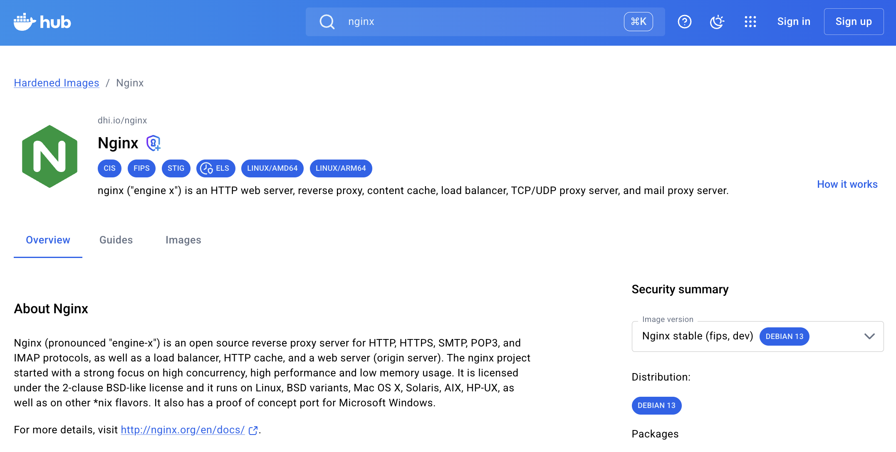

# 01 — Docker 核心概念與基本操作

角色設定：

- **Ocean** — SDC SRE Team 新進成員，負責維護社團的基礎設施和部署流程，還在摸索中，常常搞出各種狀況。
- **Andrew** — 整天在喝酒的 SDC 社長，熟悉社團大小事。
- **Snow** — SDC 開發部長，明明很聰明但常常把事情丟給 Ocean 做，口頭禪是「歐不」。

## 1.1 什麼是容器化？

容器化（Containerization）是一種將「應用程式」及其「完整執行環境」包括程式語言、相依套件、設定檔與環境變數，封裝為方便轉移的元件的技術，而這個元件稱為容器（Container）。應用與環境被一起打包起來，它就容易做版本控制，在開發者間共享，並縮短了啟動服務所需要的時間與先備知識。無論把容器部署到開發者的筆電、測試伺服器，還是雲端正式環境，執行結果都會保持一致。

這帶來幾個明顯的好處：團隊成員不再需要各自手動建置環境、不同專案的相依套件可以完全隔離、開發與正式環境的差異大幅縮小。容器化特別適合用在多人協作開發、CI/CD 流水線，以及需要快速複製環境的場景。

想像一個情境，SDC 有很多個新鮮的肝正在協作開發一個由 Go 撰寫的網頁應用，專案依賴 PostgreSQL 資料庫與特定版本的函式庫。今天，身為 Project Team 的 Andrew 想要請 SRE Team 的 Ocean 把這個服務上線，兩個人的電腦環境差異很大：

| 開發者 | 作業系統 | Go 版本 | PostgreSQL 版本 | 函式庫版本 |
|--------|---------|---------|----------------|-----------|
| Andrew | macOS   | 1.21    | 15             | v2.3.1    |
| Ocean  | Ubuntu  | 1.19    | 14             | v2.1.0    |

Andrew 的程式原本在 macOS 上跑得順順的，但當程式轉移到 Ocean 的電腦之後就看到終端機噴錯了。Ocean 看著空空如也的 README 不知道要從哪裡改設定，在跟 Claude Code 奮戰兩個小時之後大喝了兩口 Whiskey，一不小心睡著了。

Andrew 因為答應了計中明天要上線，只好自己登入到系辦的機器上部署服務。因為正式環境又是另一套設定，程式剛一執行就跑出了 2000 行的 errors。可憐的 Andrew 只好一邊咒罵 SRE Team，一邊喝著自己的 Triple espresso with Vodka，跟這些 errors 奮鬥到天亮。

還好這些不是真實故事，~~因為 Ocean 會乖乖地部署完服務再睡覺~~，用 Container 包裝服務也可以避免這件事情發生。

### 容器化的適用場景

- 多人協作開發：不同人使用不同作業系統與不同版本的工具，容器確保每個人在啟動服務的時候可以有完全相同的執行環境，減少設定時間。

- 標準化的專案啟動程序：規範開發者把專案需求與啟動方式明確定義在 Dockerfile 中，作為一種 Single truth of source，取代容易過時的手動安裝說明。

- 一致的部署流程：因為容器打包了環境，所以開發、測試與正式環境都可以使用同一個設定流程，大幅降低環境差異導致的問題。

### Docker 是什麼？

Docker 是一個跑容器的服務，它把「容器技術」包裝成一套好用的工具鏈和生態系，讓開發者可以輕鬆建立、啟動容器，並分享給其他人。

從「包服務」的那一端看：開發者把執行環境的完整規格寫成 Dockerfile，定義服務怎麼啟動，而 Docker 可以依照 Dockerfile 建置出映像檔（Image），作為啟動容器的藍圖。建好的 Image 可以上傳到 Registry（放 Image 的公共倉庫），讓其他人可以使用。

從「用服務」的那一端看：把 Image 下載到本機之後，用 Docker 就能依照 Image 把容器跑起來，開始使用別人包好的服務。

## 1.2 容器 vs 虛擬機器

在聽完 Snow 對 Docker 的介紹之後，Ocean 的第一個問題是：「這跟 VM 有什麼不一樣？不都是把東西在隔離的環境跑起來？」
Snow：「他們在做類似的事情，但要解決的問題不一樣。」

虛擬機器透過 Hypervisor（虛擬機管理程式）在硬體上模擬出多台虛擬主機（Virtual Machine, VM），每台 VM 都運行了完整的作業系統，並把 Kernel 和 User Space 全部包在裡面，讓他們可以被當作獨立的電腦來用。對於開發者而言，他就可以在虛擬機裡面開發與執行不同作業系統的服務、備份機器情況、將一台機器分給多位使用者等等。常見的 Hypervisor 有 VMware、KVM、PVE 等等。

而容器不模擬硬體層，而是直接在使用者的主機上利用 Linux 核心本身的功能來隔離程序。所有容器共用同一個主 Kernel，每個容器只包含應用程式跟它需要的函式庫。

### 架構比較

```
┌──────────────────────────────┬──────────────────────────────┐
│        虛擬機器 (VM)          │        容器 (Container)       │
├──────────────────────────────┼──────────────────────────────┤
│                              │                              │
│  ┌────────┐  ┌────────┐      │  ┌────────┐  ┌────────┐      │
│  │ App A  │  │ App B  │      │  │ App A  │  │ App B  │      │
│  ├────────┤  ├────────┤      │  ├────────┤  ├────────┤      │
│  │ Bins/  │  │ Bins/  │      │  │ Bins/  │  │ Bins/  │      │
│  │ Libs   │  │ Libs   │      │  │ Libs   │  │ Libs   │      │
│  ├────────┤  ├────────┤      │  └────┬───┘  └───┬────┘      │
│  │Guest OS│  │Guest OS│      │       │          │           │
│  └────┬───┘  └───┬────┘      │  ┌────┴──────────┴─────┐     │
│  ┌────┴──────────┴────┐      │  │   Docker Engine     │     │
│  │    Hypervisor      │      │  ├─────────────────────┤     │
│  ├────────────────────┤      │  │     Host OS         │     │
│  │     Host OS        │      │  ├─────────────────────┤     │
│  ├────────────────────┤      │  │    Infrastructure   │     │
│  │   Infrastructure   │      │  └─────────────────────┘     │
│  └────────────────────┘      │                              │
│                              │                              │
└──────────────────────────────┴──────────────────────────────┘
```

相較於 VM，Container 不包含一整套作業系統，因此每個容器的大小可以控制在幾百 MB，適合做服務的部署。

| 比較項目 | 虛擬機器 (VM) | 容器 (Container) |
|---------|--------------|-----------------|
| **隔離方式** | 硬體層虛擬化 (Hypervisor) | 作業系統層虛擬化 (Namespace + Cgroup) |
| **Guest OS** | 每台 VM 都有完整的 OS | 共用主機核心，無 Guest OS |
| **映像檔大小** | GB 級（含完整 OS） | MB 級（App + Libs） |
| **資源佔用** | 高（每台都需分配 CPU、記憶體給 OS） | 低（共用核心，按需分配） |
| **部署密度** | 一台伺服器通常跑數台至數十台 VM | 一台伺服器可跑數十至數百個容器 |
| **適用場景** | 強隔離需求、不同 OS、遺留系統 | 微服務、CI/CD、快速部署、開發環境 |

---

## 1.3 用 Docker 啟動服務

Ocean 聽完概念後躍躍欲試。剛好每次 Andrew 都會趁 Ocean 不在的時候，偷偷往他電腦裡面下載一些怪東西，而他前段時間下載的 OrbStack 剛好可以用來啟動 Docker。

> 如果還沒有安裝 Docker，請參考根目錄的 README.md 的安裝流程。

確認電腦中有正確安裝 docker：

```bash
# 驗證安裝
docker version
```

**預期輸出：**

```
Client:
 Version:           28.5.2
 API version:       1.51 ......
```

看到這段訊息就代表 Docker 裝好了。接著我們用 docker run 跑一個容器：

```bash
docker run --name first-container hello-world 
```

你會看到：

```
Hello from Docker!
This message shows that your installation appears to be working correctly.
```

接著跑一個 Nginx 網頁伺服器：

```bash
docker run --name my-nginx -p 8080:80 nginx:1.27-alpine
```

我們可以在 `http://localhost:8080` 找到這個應用（看到 404 Not Found 就代表服務啟動起來了）。

我們可以用 `docker ps` 指令列出所有正在運行的 containers：

```
CONTAINER ID   IMAGE                STATU           PORTS                  NAMES
7bbb864c2612   nginx:1.27-alpine    Up 14 minutes   0.0.0.0:8080->80/tcp   my-nginx
```

測試完成之後我們需要停止這個容器，你可以在原本的 Terminal session 當中按 `ctrl + c` 終止服務，或是新開一個 session 打以下指令把服務停掉：

```bash
docker stop my-nginx
```

> `run hello-world` 和 `run nginx` 都在執行容器，但 `run hello-world` 容器在執行後會自動停止，因此這裡只需要停止 nginx。

這個容器在停止之後還會留在電腦上面，我們需要徹底清理掉他：

```bash
docker rm my-nginx
docker rm first-container
```

到這裡就把一個容器的生命週期做完了。

其實不用 Docker 也可以跑 Nginx。以 MacOS 為例，我們可以用 `brew install nginx` 安裝 nginx 套件，`brew services start nginx` 啟動 nginx，要打的指令其實差不多，但他們的使用情境不太一樣。

### 核心差別：裝進系統 vs. 隔離執行

| 面向 | Homebrew | Docker |
|------|-----------------|--------------|
| 本質 | 把套件裝進你的系統 | 把應用跑在隔離的容器裡 |
| 影響 | 改變主機  | 不動主機  |
| 多版本 | 通常只能裝一個 | 同時跑多版本互不干擾 |

他們各自有適合的場景：

Brew 會用來裝我們每天會叫用的 CLI 工具，例如：`git`、`jq`、`kubectl`、`go`、`node`；
Docker 會用來執行會被部署、需要隔離的應用服務，例如：`postgres`、`redis`、`kafka`、你自己寫的後端服務

> 想知道 `docker` 指令背後怎麼跟 Docker Daemon、containerd、Registry 互動，請參考 [附錄 E：Docker 架構](appendix.md#附錄-edocker-架構)。

---

## 1.4 映像檔（Image）

前面提過 Docker 會依照 Dockerfile 把服務打包成映像檔（Image），裡面放了跑這個應用所需的完整執行環境，包含作業系統基礎檔案、執行環境、程式碼、相依套件、設定檔等等。開發者拿到一張 Image 就能依照它把容器（Container）跑起來。

執行 `docker run` 的時候必須指定一張 Image。像剛剛的 `docker run hello-world`，就是以 `hello-world` 為基底 Image 跑一個容器。第一次執行時，終端機上會先出現 `Unable to find image 'hello-world:latest' locally` 跟 `Pulling from library/hello-world` 的訊息，代表本機沒有這張 Image，Docker 會自動從 registry 把它拉下來，再繼續啟動容器。

Docker 預設的 registry 是 [Docker Hub](https://hub.docker.com)，你可以把它想成「Image 版的 GitHub」，上面有大量官方與社群維護的 Image，像 `nginx`、`postgres`、`redis` 這些常見的開源服務。



實務上不太需要手動 `docker pull`，`docker run` 遇到本機沒有的 Image 會自動 pull。用 `docker images` 查看本機已經抓下來的 Image：

```bash
docker images
```

輸出範例：

```
REPOSITORY                  TAG       IMAGE ID       CREATED         SIZE
sre-workshop-capstone-app   latest    f059fe7ba768   20 hours ago    17.3MB
ardge/devcontainer-base     26.04.2   6c59207e643a   2 weeks ago     3.07GB
ardge/devcontainer-base     26.04.1   548e41b4cc13   2 weeks ago     3.06GB
```

一張 Image 通常幾十 MB 到數百 MB 不等，用久了會在本機累積，記得定期清理：

```bash
# 刪除指定映像檔
docker rmi nginx:1.27

# 刪除所有未使用的映像檔（dangling images）
docker image prune
```

### 映像檔和容器的關係

每一個容器會有恰好一個 Image，可以在 `docker ps` 看到每個容器對應的 Image：

```
CONTAINER ID   IMAGE               STATUS          PORTS                  NAMES
7bbb864c2612   nginx:1.27-alpine   Up 14 minutes   0.0.0.0:8080->80/tcp   my-nginx
```

反過來，同一張 Image 可以跑出好幾個彼此獨立的容器。試著用 `nginx:1.27-alpine` 再多跑幾個：

```bash
docker run -d --name nginx1 -p 8081:80 nginx:1.27-alpine
docker run -d --name nginx2 -p 8082:80 nginx:1.27-alpine
docker run -d --name nginx3 -p 8083:80 nginx:1.27-alpine
```

> `-d` 是 detach 模式，讓容器在背景運行。

再執行一次 `docker ps`：

```
CONTAINER ID   IMAGE               STATUS              PORTS                  NAMES
675eac764576   nginx:1.27-alpine   Up About a minute   0.0.0.0:8083->80/tcp   nginx3
39b94aa0395a   nginx:1.27-alpine   Up About a minute   0.0.0.0:8082->80/tcp   nginx2
99f4a490669c   nginx:1.27-alpine   Up About a minute   0.0.0.0:8081->80/tcp   nginx1
```

三個容器都以 `nginx:1.27-alpine` 為基底，但各自獨立運作。靠這個特性，一台機器上就能輕鬆跑起同一個服務的多個副本，或是不同版本的服務，彼此互不干擾。

> Image 下載到本機之後，容器可以用非常快的速度啟動。

### 映像檔的分層架構

一個映像檔是由好幾個 Layer 疊起來的，每一層都記錄了一個變更。以 nginx 為例：最底層是 Alpine Linux 的基礎檔案，往上可能是安裝 Nginx、複製設定檔、設定啟動指令等等。我們可以用 `docker history` 看到它的分層：

```bash
docker history nginx:1.27-alpine
```

Image 的每一層都是唯讀的，建出來之後就不能修改，同一份 Dockerfile 永遠會建出相同的 Image。容器跑起來的時候，Docker 會在 Image 之上再疊一層可讀寫的「容器層」，容器執行期間所有的變更（新建檔案、修改設定、寫入日誌）都存在這一層。同一張 Image 跑出的不同 Container 各自擁有獨立的可寫層，資料因此可以互相隔離。

```
┌─────────────────────────────────────────────┐
│  Container = Image Layers + 可寫層           │
├─────────────────────────────────────────────┤
│                                             │
│  ┌──────────────────────────────────┐       │
│  │  Container Layer（可讀寫）         │      │
│  │  新建的檔案、修改的設定、日誌等       │      │
│  │                                  │       │
│  │  ⚠ 容器刪除時，這一層就消失了！      │       │
│  ├──────────────────────────────────┤       │
│  │  Layer 3: Nginx 啟動設定（唯讀）   │       │
│  ├──────────────────────────────────┤       │
│  │  Layer 2: 安裝 Nginx（唯讀）       │Image  │
│  ├──────────────────────────────────┤Layers │
│  │  Layer 1: Alpine Linux（唯讀）    │       │
│  └──────────────────────────────────┘       │
│                                             │
└─────────────────────────────────────────────┘
```

### 映像檔命名與 Tag

每個映像檔可以有多個 Tag 來區分版本。命名格式長這樣：

```
┌────────────────────────────────────────────────────────────┐
│                    映像檔命名格式                            │
├────────────────────────────────────────────────────────────┤
│                                                            │
│  完整格式：                                                  │
│  [registry/][username/]repository[:tag]                    │
│                                                            │
│  範例：                                                     │
│  docker.io/library/nginx:1.27-alpine                       │
│  ├────────┘├──────┘├────┘├─────────┘                       │
│  │         │       │     └─ Tag（版本標記）                  │
│  │         │       └─ Repository（映像檔名稱）               │
│  │         └─ Username（官方映像檔為 library，通常省略）       │
│  └─ Registry（預設 docker.io，通常省略）                      │
│                                                            │
│  常見 Tag 慣例：                                             │
│  nginx:latest        → 最新版（不建議正式環境使用）             │
│  nginx:1.27.3        → 精確版本（正式環境建議使用）             │
│  nginx:1.27-alpine   → 基於 Alpine 的精簡版                  │
│                                                            │
└────────────────────────────────────────────────────────────┘
```

---

## 1.5 容器基本操作

回顧前面講到的東西，我們已知開發者會用 Dockerfile 定義程式的運行步驟，將它建立成 Docker Image。其他人就可以用 `docker run` 指令去執行一個容器，下面是前面章節的指令的詳細介紹。

```
Dockerfile ──→ Docker Image ─── docker run ──→ Container
（建置腳本）    （成品）          （執行）       （跑起來的容器）
```

### 建立並啟動容器

```bash
# 基本語法
docker run [OPTIONS] IMAGE [COMMAND] [ARG...]

# 前景模式執行（Ctrl+C 可停止）
docker run nginx:1.27-alpine

# 指定容器名稱
docker run --name my-nginx nginx:1.27-alpine

# 執行後自動刪除容器（適合一次性任務，後面可以直接接參數是要執行的命令，nginx -v 是看 nginx 的版本。）
docker run --rm nginx:1.27-alpine nginx -v
```

### 常用 `docker run` 參數

| 參數 | 說明 | 範例 |
|------|------|------|
| `-d` | 背景執行（detach） | `docker run -d nginx` |
| `--name` | 命名容器 | `docker run --name web nginx` |
| `-p` | Port mapping（host:container） | `docker run -p 8080:80 nginx` |
| `-v` | 掛載 Volume | `docker run -v /data:/app/data nginx` |
| `-e` | 設定環境變數 | `docker run -e DB_HOST=db nginx` |
| `--rm` | 停止後自動刪除 | `docker run --rm nginx` |
| `--network` | 指定網路 | `docker run --network=mynet nginx` |

### 列出容器

```bash
# 列出執行中的容器
docker ps

# 列出所有容器(包含已停止的)
docker ps -a

```

### 容器生命週期管理

```bash
# 停止容器（發送 SIGTERM，等待容器優雅關閉）
docker stop my-nginx

# 啟動已停止的容器
docker start my-nginx

# 刪除已停止的容器
docker rm my-nginx

# 強制刪除執行中的容器
docker rm -f my-nginx

# 刪除所有已停止的容器
docker container prune
```

---

## 1.6 Port Mapping

Ocean 想 demo 給 Andrew 看自己學會用 Docker 了，很帥氣地打了 `docker run nginx:1.27-alpine`，打開瀏覽器想要連接 `http://localhost:3000`，結果發現 "This site can’t be reached"。Ocean 以為是容器沒有順利啟動，打了 `docker ps` 卻發現容器跑得好好的。

Andrew 看了一眼指令：「你沒加 `-p`，port 根本沒開出來啊。」

Ocean：「port 是什麼？」

Snow：「6」

### 把流量導出來

一台電腦上同時會跑很多網路服務：Web Server、資料庫、SSH 等。它們共用同一個 IP 位址，作業系統透過 **Port**（連接埠，範圍 0–65535）區分流量該送給哪個程式。

每個容器都有獨立的網路空間（Network Namespace），容器內部的服務對主機而言是不可見的。**Port Mapping** 的作用就是在主機與容器之間建立一條轉發通道，將主機指定 port 收到的流量轉發至容器內的 port。

| 名詞 | 說明 | 範例 |
|------|------|------|
| **Container Port** | 應用程式在容器內監聽的 port，僅存在於容器的網路空間中，主機無法直接存取 | Node.js `app.listen(3000)` → Container Port 為 3000 |
| **Host Port** | 主機對外開放的 port，Docker 監聽此 Port 並轉發流量至對應的 Container Port | `-p 8080:3000` → Host Port 為 8080 |

```
┌──────────────────────────────────────────────────────────────────┐
│                           Docker Host                            │
├──────────────────────────────────────────────────────────────────┤
│                                                                  │
│     Host Port                Container Port                      │
│     ┌──────┐                 ┌──────┐                            │
│ ───▶│ 8080 │────────────────▶│  80  │  Apache    (Container 1)   │
│     │      │                 └──────┘                            │
│     │      │                                                     │
│     │      │                 ┌──────┐                            │
│ ───▶│ 6603 │────────────────▶│ 3306 │  MySQL     (Container 2)   │
│     └──────┘                 └──────┘                            │
│                                                                  │
└──────────────────────────────────────────────────────────────────┘
  ↑ 瀏覽器 / 客戶端從外部連進來
```

上圖示範了兩個容器同時運作的情境：

- **Container 1（Apache）** 在容器內監聽 `80`，主機把 `8080` 這個 Host Port 對應過去。使用者打 `http://localhost:8080` 的時候，流量會先進到主機的 8080，再被 Docker 轉發到容器內的 80。
- **Container 2（MySQL）** 在容器內監聽 `3306`，主機把 `6603` 對應過去。資料庫用戶端連 `localhost:6603`，實際上連到的是容器裡的 MySQL。

同一台 Docker Host 上可以跑很多容器，只要 Host Port 不互相衝突就沒問題；Container Port 彼此獨立，十個容器都在容器內監聽 3306 也不會撞到。

### 語法

```bash
# -p <Host Port>:<Container Port>
docker run --name web -p 8080:80 nginx:1.27-alpine
```

### 常用變化

| 用法 | 指令 | 說明 |
|------|------|------|
| 對映多個 Port | `docker run -p 8080:80 -p 8443:443 nginx` | 同時開放 HTTP 與 HTTPS |
| 限定綁定 IP | `docker run -p 127.0.0.1:8080:80 nginx` | 只允許本機連線，不對外開放 |

---

## 1.7 資料持久化

Ocean 學會 Port Mapping 之後，原本就已經在自信之巔的他再度信心大增，決定把社團的 Postgres 資料庫也用 Docker 跑起來。他花了一個下午匯入資料、調整設定，一切運作良好。隔天早上 Ocean 發現容器不知道為什麼停了，他想說沒關係，砍掉重跑一個就好：

```bash
docker rm db && docker run --name db postgres:17-alpine
```

打開資料庫一看，裡面比新的還乾淨，喔不對他就是新的。Ocean 崩潰地跑去找 Snow：「我的資料呢？！」Snow 淡定地喝了一口咖啡：「容器砍掉，裡面的可寫層就沒了啊。還記得 1.4 節講的嗎？」

Ocean 這才想起來，容器的可寫層是跟著容器走的，`docker rm` 的瞬間，資料庫的紀錄、使用者上傳的檔案、辛辛苦苦產生的 log，全部歸零。

Snow：「噢不。」

### Volume 與 Bind Mount

Docker 有兩種主要的方式把容器的資料儲存在開發者的本機當中，讓資料可以跨容器生命週期保留下來：

| 類型 | 儲存位置 | 設定方法 | 範例 | 適用場景 |
|------|---------|---------|-----|---------|
| **Bind Mount（綁定掛載）** | 主機上指定的目錄 | `-v <主機路徑>:<容器路徑>` | `-v /home/user/code:/app` | 開發時同步原始碼，改本機檔案會直接反映到容器內 |
| **Named Volume（具名資料卷）** | 由 Docker 管理，放在 host 的 `/var/lib/docker/volumes/` | `-v <Volume 名稱>:<容器路徑>` | `-v mydata:/var/lib/mysql` | 資料庫等需要持久化、也不用從 host 直接存取的資料 |


Bind Mount 範例（把目前目錄下的 `html/` 掛進 nginx 容器）：

```bash
docker run -d --name web -p 8080:80 -v $(pwd)/html:/usr/share/nginx/html nginx:1.27-alpine
```

> `$(pwd)` 是 shell 取當前目錄絕對路徑的語法。Docker 要求 Bind Mount 一律用絕對路徑。

Named Volume 範例（把 postgres 的資料放到 `pgdata` 這個 Volume）：

```bash
docker volume create pgdata
docker run -d --name db -v pgdata:/var/lib/postgresql/data postgres:17-alpine
```

> Named Volume 使用前要先用 `docker volume create` 建立，像宣告變數一樣。

Volume 的管理指令：

```bash
# 列出所有 Volume
docker volume ls

# 查看 Volume 詳細資訊
docker volume inspect pgdata

# 刪除指定 Volume
docker volume rm pgdata

# 刪除所有未使用的 Volume（執行前請先問你家老大）
docker volume prune
```

---

## 1.8 容器除錯

### 查看日誌

```bash
docker logs my-nginx
```

| 參數 | 效果 | 範例 |
|------|------|------|
| `-f` | 持續追蹤，類似 `tail -f` | `docker logs -f my-nginx` |
| `--tail N` | 只看最後 N 行 | `docker logs --tail 100 my-nginx` |
| `-t` | 顯示時間戳記 | `docker logs -t my-nginx` |
| `--since` | 指定時間之後的日誌 | `docker logs --since 2024-01-01 my-nginx` |

參數可以組合使用，例如 `docker logs -f --tail 50 -t my-nginx` 就是持續追蹤最後 50 行並顯示時間。

### 進入容器內部

```bash
# 在容器內開啟 shell
docker exec -it my-nginx sh

# 執行單一命令（不進入互動模式）
docker exec my-nginx cat /etc/nginx/nginx.conf

# 以 root 身份進入
docker exec -it -u root my-nginx sh
```

> `-i` 保持標準輸入開啟（interactive），`-t` 分配偽終端（tty），兩個一起用是常見組合。基底是 Alpine 的 Image 通常沒有 bash，要用 `sh` 進去。

### 查看資源使用狀況

```bash
# 即時顯示所有容器的資源使用
docker stats

# 只看特定容器
docker stats my-nginx
```

輸出範例：

```
CONTAINER ID   NAME       CPU %   MEM USAGE / LIMIT     MEM %   NET I/O
a1b2c3d4e5f6   my-nginx   0.00%   3.441MiB / 7.667GiB   0.04%   1.45kB / 0B
```

---

## 1.9 練習 1：執行你的第一個容器

完成以下練習： [exercises/01-first-container.md](exercises/01-first-container.md)

→ 下一章：[02-docker-compose.md](02-docker-compose.md)
