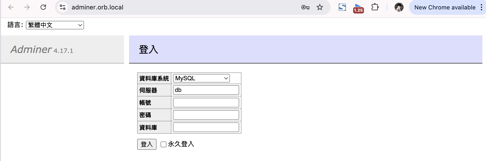

# 02 — Docker Compose 多容器編排

## 2.1 為什麼需要 Docker Compose？

Ocean 現在會跑容器了，但每次要啟動服務都要手動打一串 `docker run`，參數又臭又長。更慘的是，上次好不容易把資料庫跟一個網頁 Admin 介面兩個容器兜起來了，結果 Snow 問他：「指令記在哪？」Ocean：「...我記在腦袋裡。」Snow：「喔不。」

**Docker Compose** 是 Docker 官方提供的多容器編排工具，透過一個 YAML 設定檔定義所有容器的狀態（映像檔、連接埠、Volume、環境變數、相依關係），再以單一指令 `docker compose up` 完成整個應用的部署。設定檔可以納入版本控制，團隊成員只要 clone 專案、執行一次指令，就能在本機重現完整的服務環境。如果你使用 OrbStack，Docker Compose 已內建其中，並且可以透過 `docker compose version` 確認正在運行中的版本。

下面用「PostgreSQL + Adminer」這個組合來示範：`postgres` 是資料庫，`adminer` 是一個輕量的網頁資料庫管理介面。使用者打開瀏覽器連 Adminer，Adminer 再透過內部網路連到 Postgres。

```
┌──────────────────────────────────────────────────────┐
│                  PostgreSQL + Adminer                │
├──────────────────────────────────────────────────────┤
│                                                      │
│                   ┌──────────┐                       │
│                   │  Client  │                       │
│                   └────┬─────┘                       │
│                        │ http://localhost:8080       │
│                        ▼                             │
│              ┌──────────────────┐                    │
│              │     Adminer      │  ← Container 1     │
│              │  (DB Admin UI)   │                    │
│              │   (Port 8080)    │                    │
│              └────────┬─────────┘                    │
│                       │  db:5432                     │
│                       ▼                              │
│              ┌──────────────────┐                    │
│              │   PostgreSQL     │  ← Container 2     │
│              │   (Port 5432)    │                    │
│              └──────────────────┘                    │
│                                                      │
└──────────────────────────────────────────────────────┘

```

在不用 Docker Compose 的情況下，我們會手打這些指令啟動服務：

```bash
# 建立網路（後面會說明）
docker network create myapp

# 啟動 PostgreSQL
docker run -d --name db --network myapp \
  -e POSTGRES_PASSWORD=secret \
  -v pgdata:/var/lib/postgresql/data \
  postgres:17-alpine

# 啟動 Adminer
docker run -d --name adminer --network myapp \
  -p 8080:8080 \
  -e ADMINER_DEFAULT_SERVER=db \
  adminer:4
```

這三段指令分別做：先建立一個自訂網路，再起 Postgres，再起 Adminer。所有 flag 都是第一章看過的東西，差別只在這次有兩個容器需要互相找到對方。

> - `docker network create myapp`：開一個 bridge 網路。這兩個容器都會加進這個網路彼此通訊。
> - **Postgres**：`--name db` 是容器名稱、`-e POSTGRES_PASSWORD=secret` 設定密碼、`-v pgdata:/var/lib/postgresql/data` 把資料儲存在 Volume 裡面。
> - **Adminer**：`-p 8080:8080` 把 Adminer 的 web 介面對外開出來、`-e ADMINER_DEFAULT_SERVER=db` 預先填好「預設要連的資料庫主機」，這個 `db` 就是上面 Postgres 容器的名稱。

同樣的容器配置，可以被 Docker compose 用一個 `docker-compose.yml` 所描述：

```yaml
services:
  db:
    image: postgres:17-alpine
    environment:
      POSTGRES_PASSWORD: secret
    volumes:
      - pgdata:/var/lib/postgresql/data

  adminer:
    image: adminer:4
    ports:
      - "8080:8080"
    environment:
      ADMINER_DEFAULT_SERVER: db
    depends_on:
      - db

volumes:
  pgdata:
```

接著執行 `docker compose up -d`，就可以達成和手打 docker run 一樣的效果。打開 `http://localhost:8080` 會看到 Adminer 的登入畫面，系統名稱選 PostgreSQL、使用者填 `postgres`、密碼填 `secret`，就能連到資料庫了。



接著來看每個欄位在做什麼：

### services

最上層的 `services` 區塊定義了所有要跑的容器。這裡定義了兩個服務 `db` 與 `adminer`。

### image

```yaml
image: postgres:17-alpine
```

指定要用哪個映像檔。跟 `docker run postgres:17-alpine` 一樣的意思。

### ports

```yaml
ports:
  - "8080:8080"
```

Port Mapping，格式是 `"主機:容器"`。等同於 `docker run -p 8080:8080`。

### environment

```yaml
environment:
  POSTGRES_PASSWORD: secret
  ADMINER_DEFAULT_SERVER: db
```

設定環境變數。等同於 `docker run -e POSTGRES_PASSWORD=secret`。

### volumes

```yaml
volumes:
  - pgdata:/var/lib/postgresql/data
```

掛載 Volume。等同於 `docker run -v pgdata:/var/lib/postgresql/data`。這裡用的是 Named Volume，資料由 Docker 管理。

檔案最下面的 `volumes:` 區塊是宣告這個 Named Volume：

```yaml
volumes:
  pgdata:
```

### depends_on

```yaml
depends_on:
  - db
```

告訴 Compose 啟動順序：先啟動 `db`，再啟動 `adminer`。不過要注意，`depends_on` 只等容器啟動，不等服務真正準備好。實際上 PostgreSQL 容器啟動後還需要幾秒初始化，這段時間只要有後端連過去就會直接噴錯，所以通常會搭配 `healthcheck` 使用。

在這個例子中，就是用 `depends_on` 搭配 `condition: service_healthy`：

```yaml
services:
  adminer:
    image: adminer:4
    depends_on:
      db:
        condition: service_healthy  # 等 db 的 healthcheck 通過才啟動

  db:
    image: postgres:17-alpine
    healthcheck:
      test: ["CMD-SHELL", "pg_isready -U postgres"]
      interval: 5s
      timeout: 5s
      retries: 5
```

`service_healthy` 的意思是 `healthcheck` 已經回傳成功；`pg_isready` 是 PostgreSQL 內建的檢查工具，Compose 每 5 秒問一次「資料庫好了沒」，連續失敗 5 次才判定不健康。`adminer` 會等到 db 的 healthcheck 通過才啟動。

### 常用 Compose 指令

看完 YAML 設定之後，再補幾個日常會用到的指令：

```bash
# 啟動所有服務（背景執行）
docker compose up -d

# 看看服務狀態
docker compose ps

# 停止並移除所有容器
docker compose down

# 看某個 service 的日誌
docker compose logs <service_name>

# 進入 adminer 容器的 shell
docker compose exec adminer sh
```

---

## 2.2 Network

在 1.6 我們學到，容器的網路是隔離的，外面連不進去要靠 Port Mapping，而容器跟容器之間預設也是連不通的。要讓多個容器能互相溝通，就需要把它們放進同一個 **Docker Network**（虛擬網路）。它們是一條虛擬的網路線，只有接在同一條線上的容器才能互相找到對方。

2.1 的 `docker run` 範例裡，我們手動跑了 `docker network create myapp`，然後每個容器都加上 `--network myapp` 才能互連。而 Compose 版本完全沒寫到網路，是因為 Docker Compose 會自動建立一個預設網路，把 `docker-compose.yml` 裡定義的所有服務都放進去。你不用寫任何網路設定，容器之間就能互相連線。

<details>
<summary>在這個網路裡面，<strong>hostname 就等於服務名稱</strong>。</summary>

在 2.1 的範例中：

```yaml
environment:
  ADMINER_DEFAULT_SERVER: db
```

Adminer 啟動後會用 `db` 當 hostname 去連資料庫，Compose 內建的 DNS 會自動把 `db` 解析到 PostgreSQL 容器的 IP。換個角度，如果有個 API 服務想連同一個資料庫，環境變數會寫成類似 `DATABASE_URL: postgres://postgres:secret@db:5432/mydb`，裡面的 `@db` 也是同樣的道理。服務改叫 `database`，這裡就要跟著改成 `database`。

> **注意**：這個 DNS 只在 Compose 的虛擬網路裡面有效。在主機上打 `ping db` 是不會通的。

</details>

## 2.3 環境變數管理

Ocean 把 2.1 的 compose 整份 commit 上 public repo，三分鐘後收到 GitHub Secret Scanning 的警告信。Snow：「噢不。」

2.1 的範例裡，我們把密碼直接寫在 `docker-compose.yml` 裡面：

```yaml
environment:
  POSTGRES_PASSWORD: secret
```

如果把 `docker-compose.yml` 推進 Git，密碼就跟著推上去了。（~~希望~~）我們都知道，敏感資訊需要被抽到 `.env` 檔案裡，在 `.gitignore` 排除它，才可以避免密鑰洩漏，在這裡也是一樣，我們可以先建立一個 `.env` 檔案，跟 `docker-compose.yml` 放在同一個目錄：

```bash
# .env
POSTGRES_USER=myuser
POSTGRES_PASSWORD=secret
POSTGRES_DB=mydb
```

然後在 `docker-compose.yml` 裡用 `${var}` 引用：

```yaml
services:
  db:
    image: postgres:17-alpine
    environment:
      POSTGRES_USER: ${POSTGRES_USER}
      POSTGRES_PASSWORD: ${POSTGRES_PASSWORD}
      POSTGRES_DB: ${POSTGRES_DB}
```

Compose 會自動讀取同目錄下的 `.env` 檔案，把變數帶進去。這樣 `docker-compose.yml` 裡面就不會有密碼，可以安心推進版本控制。

如果覺得一個一個寫 `${...}` 太麻煩，也可以用 `env_file` 一口氣把整個 `.env` 載入容器：

```yaml
services:
  adminer:
    env_file:
      - .env
```

---

→ 下一章：[03-dockerfile.md](03-dockerfile.md)
