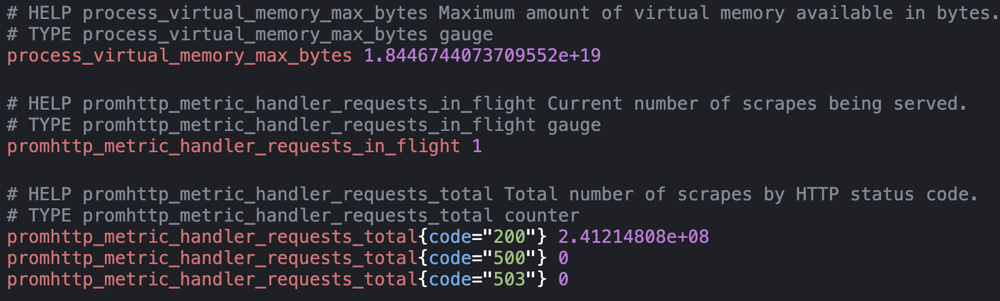
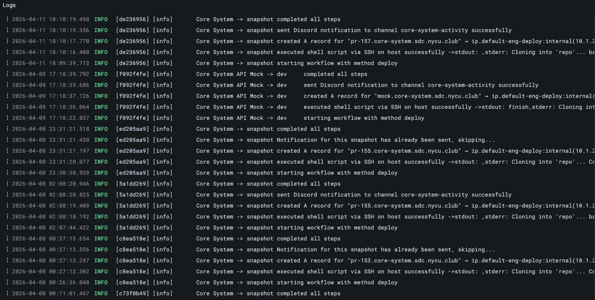
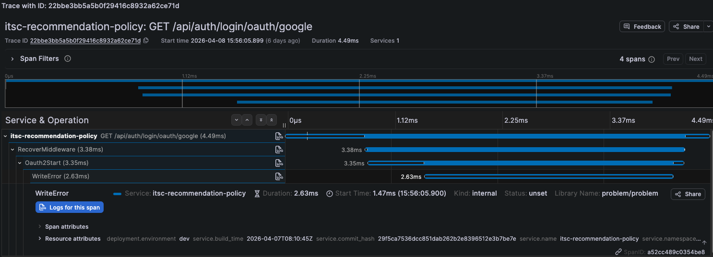

# 01 — Monitoring 概念介紹


---

## 目錄

- [01 — Monitoring 概念介紹](#01--monitoring-概念介紹)
  - [目錄](#目錄)
  - [什麼是 Monitoring？](#什麼是-monitoring)
    - [醫生](#醫生)
    - [為什麼 Monitoring 很重要？](#為什麼-monitoring-很重要)
  - [可觀測性的三大支柱 (3 Pillars)](#可觀測性的三大支柱-3-pillars)
    - [Metrics — 數值指標](#metrics--數值指標)
    - [Logs — 事件紀錄](#logs--事件紀錄)
    - [Traces — 請求追蹤](#traces--請求追蹤)
    - [三者的關係](#三者的關係)
  - [沒有 Monitoring 的世界](#沒有-monitoring-的世界)
    - [手動運維的痛點](#手動運維的痛點)
  - [有了 Monitoring 之後](#有了-monitoring-之後)
  - [為什麼選擇 Prometheus？](#為什麼選擇-prometheus)
  - [課程目標](#課程目標)
  - [Conclusion](#conclusion)

---

## 什麼是 Monitoring？

### 醫生

假設你是一個醫生，正在照顧住院的病人。你會持續監測病人的 **生理數值**——心跳、血壓、體溫。這些數值會顯示在病床旁邊的螢幕上，一旦某個數值超出正常範圍，儀器就會發出警報，讓你在狀況惡化之前採取行動。

Monitoring 做的就是一模一樣的事情：

| 醫院場景 | SRE 場景 |
|---------|---------|
| 病人 | 我們的服務（網站、API、資料庫） |
| 生理數值（心跳、血壓） | Metrics（CPU 使用率、回應時間、錯誤率） |
| 監測螢幕 | Dashboard（Grafana） |
| 警報 | Alert 通知（Discord、Slack） |
| 醫生巡房 | Prometheus 定期 scrape |

### 為什麼 Monitoring 很重要？

想像一個沒有 monitoring 的世界：

1. 你的網站掛了 → **你不知道**
2. 使用者打電話來罵 → 你才知道出問題了
3. 你開始手動檢查各台伺服器 → 花了 30 分鐘才找到原因
4. 修好了 → 但你不知道影響了多少人、持續了多久

有了 monitoring：

1. 你的網站掛了 → **Prometheus 在 1 分鐘內偵測到**
2. Alertmanager 發送通知到 Discord → **你在 2 分鐘內知道**
3. 你打開 dashboard 看 metrics → **5 分鐘內找到問題**
4. 修好了 → dashboard 顯示服務恢復正常，你知道確切的影響範圍

Monitoring 就是讓我們從「猜測」變成「看數據找問題」

---

## 可觀測性的三大支柱 (3 Pillars)

在 SRE 領域，我們用 **可觀測性（Observability，~~O11Y~~）** 這個詞來描述「我們能不能從系統的外部輸出（outputs）來理解系統的內部狀態（internal state）」

可觀測性有三大支柱，每一種資料回答不同的問題：

### Metrics — 數值指標

**「有東西出問題了嗎？」**

Metrics 是 **數值化** 的量測資料，通常是隨時間變化的數字。它們告訴你系統的整體健康狀況。

```
CPU 使用率：85%
記憶體使用率：72%
HTTP 請求成功率：99.2%
平均回應時間：230ms
```


特點：
- 體積小、查詢快
- 適合長時間儲存
- 可以做趨勢分析和告警

### Logs — 事件紀錄

**「發生了什麼事？」**

Logs 是系統產生的 **文字紀錄**，記錄了每一個事件的詳細資訊。



特點：
- 資訊量大、非常詳細
- 體積大、查詢慢
- 適合除錯和事後分析

### Traces — 請求追蹤

**「問題出在哪裡？」**

Traces 追蹤一個請求從進入系統到離開系統的 **完整路徑**，顯示每一步花了多少時間。



特點：
- 可以跨服務追蹤
- 適合找出效能瓶頸

### 三者的關係

```
場景：使用者回報「網站很慢」

Step 1 — 看 Metrics（快速判斷範圍）
  → API 回應時間從 200ms 飆到 5000ms

Step 2 — 看 Traces（找瓶頸）
  → 發現是 database query 花了 4.8 秒

Step 3 — 看 Logs（找出根因）
  → 發現 database 的錯誤 log：「Too many connections」
```

 用醫院的比喻：
 * Metrics 是醫生在搜集病人的生理訊號 (心跳, 血壓)
 * Traces 是掃描儀掃描血液流過哪裡，並找出流血的源頭（看內部結構）
 * Logs 是醫生讀病歷，或是詢問病人病情（看詳細記錄）

---

## 沒有 Monitoring 的世界


你和朋友一起維運一個學校社團的線上服務。某天凌晨 3 點，服務掛了

1. **20:00** — 伺服器電線被小動物咬了，服務掛掉
2. **21:00** — 同學在discord裡說：「VPN怎麼連不上」
3. **22:00** — 你看到訊息，開始手動 SSH 到伺服器上檢查，發現也連不上
4. **隔天 10:00** — 你去社辦檢查，發現社辦有食物吃完沒丟被小動物入侵
5. **結果** — 服務停擺了14 小時，你完全不知道是什麼時候開始的

### 手動運維的痛點

| 問題 | 後果 |
|------|------|
| 沒有即時告警 | 問題發生後很久才知道 |
| 沒有 metrics | 不知道問題的範圍和影響程度 |
| 沒有歷史趨勢 | 無法預測問題（硬碟是慢慢滿的，早就該清了） |
| 依賴手動檢查 | 檢查的頻率和品質因人而異 |
| 沒有標準化流程 | 每次排查問題都像在探險 |

---

## 有了 Monitoring 之後

同樣的情境，但這次有了 Prometheus 和 Alertmanager：

1. **週一** — Prometheus 偵測到硬碟使用率超過 80%，觸發 **warning** alert
2. **週一** — 你收到 Discord 通知：「⚠️ Disk usage > 80%」
3. **週二** — 你安排時間清理硬碟、設定 log rotation
4. **問題解決** — 服務 **從未中斷**，使用者完全沒感覺

| 沒有 Monitoring | 有 Monitoring |
|----------------|--------------|
| 事後才知道出問題 | 問題發生前就收到預警 |
| 不知道影響範圍 | Dashboard 清楚顯示影響程度 |
| 無法預防問題 | 趨勢分析讓你提前處理 |
| 手動排查花很久 | Metrics 快速定位問題 |
| 恢復後不確定是否穩定 | Dashboard 確認服務已恢復正常 |

---

## 為什麼選擇 Prometheus？

| 優勢 | 說明 |
|------|------|
| **開源且免費** | 由 CNCF（Cloud Native Computing Foundation）維護，社群活躍 |
| **專為雲原生設計** | 原生支援 Kubernetes、Docker 等現代基礎設施 |
| **Pull-based 架構** | 主動去服務端拉資料，服務掛了也能立刻知道 |
| **強大的查詢語言** | PromQL 功能豐富，可以做複雜的資料分析 |
| **豐富的 Exporter 生態系** | 幾乎任何系統都有現成的 exporter 可用 |
| **與 Grafana 深度整合** | 搭配 Grafana 可以快速建立漂亮的 dashboard |
| **業界標準** | 是目前最被廣泛採用的開源 monitoring 方案 |


---

## 課程目標

在接下來的章節中，我們將一步一步建立一套 monitoring 系統。


```
monitoring stack
├── Prometheus      — 自動蒐集 metrics、評估告警規則
├── Node Exporter   — 抓取硬體指標（CPU、記憶體、硬碟）
├── Alertmanager    — 接收告警並發送通知到 Discord
└── Grafana         — 視覺化 metrics，建立即時 Dashboard
```


```
蒐集 (Collect) → 評估 (Evaluate) → 告警 (Alert) → 通知 (Notify) → 視覺化 (Visualize)
```


---

## Conclusion

- **Monitoring** 就是持續監測系統的健康狀態，在問題影響使用者之前就發現並處理
- 可觀測性有三大支柱：**Metrics**、**Logs**、**Traces**
- 我們將聚焦在 **Metrics**，使用 **Prometheus** 作為核心工具
- Prometheus 是開源、Pull-based 的 monitoring 系統，是雲原生監控的業界標準

---

[下一章：Prometheus 核心概念 →](02-prometheus-fundamentals.md)
