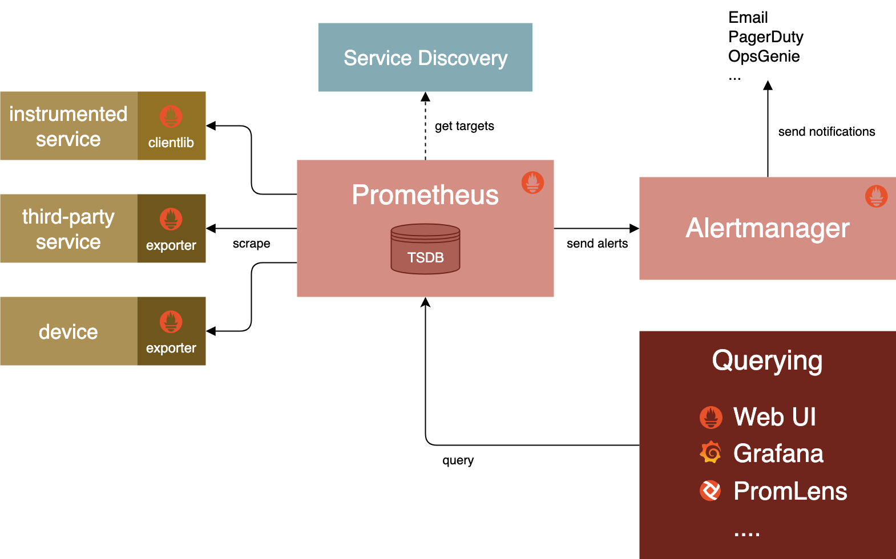

# 02 — Prometheus 核心概念

> **時間：20 分鐘**

---

## 目錄

- [02 — Prometheus 核心概念](#02--prometheus-核心概念)
  - [目錄](#目錄)
  - [學習目標](#學習目標)
  - [Prometheus 是什麼？](#prometheus-是什麼)
  - [Pull-based vs. Push-based](#pull-based-vs-push-based)
    - [Pull 的優勢](#pull-的優勢)
  - [系統架構](#系統架構)
    - [Core Components](#core-components)
    - [架構圖](#架構圖)
    - [流程](#流程)
  - [Time Series 資料模型](#time-series-資料模型)
    - [什麼是 Time Series？](#什麼是-time-series)
    - [資料的四個組成部分](#資料的四個組成部分)
  - [Metric 的四種類型](#metric-的四種類型)
    - [Counter — 只增不減的計數器](#counter--只增不減的計數器)
    - [Gauge — 可升可降的儀表](#gauge--可升可降的儀表)
    - [Histogram — 分布直方圖](#histogram--分布直方圖)
    - [Summary — 摘要](#summary--摘要)
    - [該用哪一種？](#該用哪一種)
  - [Labels — 資料的維度標籤](#labels--資料的維度標籤)
    - [為什麼需要 Labels？](#為什麼需要-labels)
    - [常見的 Label 設計](#常見的-label-設計)
    - [Label 的注意事項](#label-的注意事項)
  - [PromQL 入門](#promql-入門)
    - [基本查詢](#基本查詢)
    - [Label 篩選](#label-篩選)
    - [Range Vector — 時間範圍查詢](#range-vector--時間範圍查詢)
    - [常用函數](#常用函數)
    - [實用查詢範例](#實用查詢範例)
  - [Blackbox vs. Whitebox Monitoring](#blackbox-vs-whitebox-monitoring)
  - [Metrics 的傳輸格式](#metrics-的傳輸格式)
  - [小結](#小結)

---

## 學習目標
- Prometheus 的 pull-based 架構與優勢
- 理解 Prometheus 系統架構中各元件的角色
- 區分 Counter、Gauge、Histogram、Summary 四種 metric 類型
- 使用 Labels 來組織和篩選 metrics
- 撰寫基本的 PromQL 查詢
- 區分 Blackbox 和 Whitebox monitoring

---

## Prometheus 是什麼？

**Prometheus** 是一套開源的 monitoring 和 alerting 工具，由 SoundCloud 於 2012 年開發，2016 年成為 CNCF（Cloud Native Computing Foundation）的第二個Project（僅次於 Kubernetes）。

Prometheus 的兩大特色：

1. **Pull-based 架構** — 主動去服務端拉取 metrics，而非被動等待
2. **內建 Time Series 資料庫（TSDB）** — 高效儲存時間序列資料

> Prometheus + Kubernetes 是Cloud Native生態系中最常見的 monitoring 組合

---

## Pull-based vs. Push-based

大多數的 monitoring 系統是「被動」的——等服務主動把資料 push 過來。Prometheus 則是「主動出擊」——它會依照固定的時間間隔，主動去各個服務 pull（scrape）metrics。

```
Push-based（傳統做法）:
  Service ──推送資料──▶ Monitoring System
  Service ──推送資料──▶ Monitoring System
  Service ──推送資料──▶ Monitoring System

Pull-based（Prometheus）:
  Prometheus ──「你還好嗎？」──▶ Service A
  Prometheus ──「你還好嗎？」──▶ Service B
  Prometheus ──「你還好嗎？」──▶ Service C
```

### Pull 的優勢

| 面向 | Pull-based（Prometheus） | Push-based（傳統做法） |
|------|------------------------|-------------------|
| **Shutdown偵測** | 服務沒回應 scrape = 立刻知道掛了 | 服務掛了就不會 push，可能很久才發現 |
| **服務端設定** | 服務只需要 expose `/metrics`，不用知道 monitoring 的位置 | 服務需要設定 push 的目標地址 |
| **流量控制** | Prometheus 決定 scrape 頻率，不會被大量 push 淹沒 | 大量服務同時 push 可能造成 monitoring 系統過載 |
| **除錯方便** | 可以直接瀏覽器打開服務的 `/metrics` endpoint 查看 | 資料推送後才看得到 |

> 「醫生巡房」和「病人按鈴」的差異
> Pull-based 就像醫生每 30 分鐘固定巡房一次（主動檢查），Push-based 就像等病人按鈴才去看（被動等待）。醫生巡房的好處是即使病人昏迷了（服務掛了），醫生走到病房就知道出問題了

---

## 系統架構

### Core Components

我們的 monitoring 系統由四個核心元件組成，每個元件各司其職：

| 元件 | 負責什麼 | 類比 |
|------|---------|------|
| **Prometheus** | 蒐集 metrics、儲存 time series、評估 alert rules | 醫院的監測儀器 |
| **Exporter** | 把服務的內部指標轉換成 Prometheus 可讀的格式 | 量體溫的溫度計 |
| **Alertmanager** | 接收 alerts，分組、去重複、路由通知 | 醫院的廣播叫號系統 |
| **Grafana** | 查詢 Prometheus 資料，顯示視覺化 Dashboard | 病房裡的生理數值螢幕 |

### 架構圖



### 流程

```
蒐集 (Collect) → 評估 (Evaluate) → 告警 (Alert) → 通知 (Notify) → 視覺化 (Visualize)
    │                  │                │               │                 │
 Prometheus       Prometheus      Alertmanager    Alertmanager        Grafana
 (scrape)         (alert rules)   (routing)       (Discord/Email)    (dashboards)
```

> 💡 **講師提示：** 搭配架構圖講解時，用「蒐集 → 評估 → 告警 → 通知 → 視覺化」這五步流程串起來，讓學生理解資料如何從服務端一路流到 Discord 通知。

---

## Time Series 資料模型

### 什麼是 Time Series？

在 Prometheus 中，所有的 metrics 都以 **time series**（時間序列）的形式儲存。一筆 time series 就是一連串帶有時間戳記的數值。

```
http_requests_total{service="api", env="prod"} @ 14:00:00 = 1000
http_requests_total{service="api", env="prod"} @ 14:00:30 = 1042
http_requests_total{service="api", env="prod"} @ 14:01:00 = 1089
http_requests_total{service="api", env="prod"} @ 14:01:30 = 1120
```

如果把它畫成圖，就是一條隨時間變化的曲線。

### 資料的四個組成部分

每一筆 time series 資料包含四個部分：

```
http_requests_total{service="api", env="prod"} @ 14:00:00 = 1000
└──────┬─────────┘ └──────────┬───────────┘   └─────┬────┘   └─┬─┘
   Metric Name            Labels              Timestamp      Value
```

| 組成部分 | 說明 | 範例 |
|---------|------|------|
| **Metric Name** | 量測的指標名稱 | `http_requests_total` |
| **Labels** | 一組 key-value pairs，用來區分同名 metric 的不同維度 | `service="api"`, `env="prod"` |
| **Timestamp** | 這筆資料是什麼時候記錄的 | `14:00:00` |
| **Value** | 實際量測到的數值（64-bit 浮點數） | `1000` |

> 💡 **講師提示：** 可以用 Excel 表格來類比——Metric Name 是表格的名稱，Labels 是欄位標題，每一行是一個 timestamp + value 的組合。

---

## Metric 的四種類型

Prometheus 定義了四種 metric 類型，每種適用於不同的場景。

### Counter — 只增不減的計數器

**特性**：只會往上增加（或在重啟時歸零），永遠不會減少。

**適用場景**：累計事件的總次數。

```
# 範例：總共處理了多少個 HTTP 請求？
http_requests_total{method="GET", path="/api/users"} = 15234

# 範例：總共發生了多少個錯誤？
http_errors_total{service="api", code="500"} = 42
```

**比喻**：汽車的里程表——只會往上跳，不會倒退。

### Gauge — 可升可降的儀表

**特性**：數值可以增加也可以減少，反映某個當下的狀態。

**適用場景**：記錄目前的數值

```
# 範例：目前的記憶體使用量
memory_usage_bytes{instance="server-01"} = 4294967296

# 範例：目前的 CPU 溫度
node_hwmon_temp_celsius{chip="coretemp"} = 65.0

# 範例：目前有多少個活躍的連線？
active_connections{service="api"} = 127
```

**生活化比喻**：溫度計——溫度會上升也會下降

### Histogram — 分布直方圖

**特性**：把觀測值分配到預先定義的 buckets（區間）裡，同時記錄總數和總和。

**適用場景**：分析數值的分布情況（例如：延遲分布）。

```
# 範例：HTTP 請求回應時間的分布
# 有多少請求在 100ms 以內完成？ 500ms 以內？ 1s 以內？
http_request_duration_seconds_bucket{le="0.1"}  = 8000   # ≤ 100ms
http_request_duration_seconds_bucket{le="0.5"}  = 9500   # ≤ 500ms
http_request_duration_seconds_bucket{le="1.0"}  = 9900   # ≤ 1s
http_request_duration_seconds_bucket{le="+Inf"} = 10000  # 全部
http_request_duration_seconds_count             = 10000  # 總請求數
http_request_duration_seconds_sum               = 3250.5 # 總時間（秒）
```

**生活化比喻**：考試成績分布圖——多少人 60 分以下、60-70、70-80、80-90、90 以上。

### Summary — 摘要

**特性**：在客戶端直接計算百分位數（quantile），結果不能跨實例聚合

**適用場景**：需要精確百分位數時使用

```
# 範例：HTTP 請求回應時間的百分位數
http_request_duration_seconds{quantile="0.5"}  = 0.15   # 中位數是 150ms
http_request_duration_seconds{quantile="0.9"}  = 0.45   # P90 是 450ms
http_request_duration_seconds{quantile="0.99"} = 1.2    # P99 是 1.2s
```

### 該用哪一種？

| 情境 | 建議使用 | 原因 |
|------|---------|------|
| 計算請求總數 | **Counter** | 累計值，只增不減 |
| 記錄記憶體使用量 | **Gauge** | 數值會上下變動 |
| 分析回應時間的分布 | **Histogram** | 可以在 server-side 計算百分位，可跨實例聚合 |
| 需要精確百分位數 | **Summary** | 在 client-side 直接計算 |

``` 對初學者來說，只需要理解 **Counter**（累計次數）和 **Gauge**（當下數值）就足以應付大部分場景。Histogram 和 Summary 可以提一下概念，實作時再深入。
```
---

## Labels — 資料的維度標籤

### 為什麼需要 Labels？

想像一下，如果沒有 Labels，你只能知道「總共有 15234 個 HTTP 請求」。但有了 Labels，你可以回答更細緻的問題：

```
# 沒有 labels — 只有一個數字
http_requests_total = 15234

# 有 labels — 可以從不同維度分析
http_requests_total{service="api", method="GET", env="prod"}    = 10000
http_requests_total{service="api", method="POST", env="prod"}   = 3000
http_requests_total{service="api", method="GET", env="staging"} = 2234
```

Labels 讓你可以：

- **Filtering**：只看 production 環境的資料（`env="prod"`）
- **Grouping**：按 service 分組統計（`by (service)`）
- **Routing**：把 critical alerts 送到特定的 Discord 頻道（`severity="critical"`）

### 常見的 Label 設計

| Label | 用途 | 範例值 |
|-------|------|--------|
| `service` | 哪個服務 | `grafana`, `api`, `prometheus` |
| `env` | 哪個環境 | `prod`, `staging`, `dev` |
| `instance` | 哪個實例 | `10.0.1.5:8080` |
| `method` | HTTP 方法 | `GET`, `POST`, `PUT` |
| `status` | HTTP 狀態碼 | `200`, `404`, `500` |
| `severity` | Alert 等級 | `critical`, `warning`, `info` |

### Label 的注意事項

- 每一組唯一的 label 組合 = 一條獨立的 time series
- Label 的值不要用「高基數」的東西（如 user ID、request ID），否則會產生爆量的 time series
- Label 名稱用小寫加底線（例：`response_code`），值用小寫（例：`success`）

---

## PromQL 入門

**PromQL（Prometheus Query Language）** 是 Prometheus 的查詢語言。你可以用它在 Prometheus Web UI 或 Grafana 中查詢和分析 metrics。

### 基本查詢

```promql
# 查詢一個 metric 的所有 time series
up

# 查詢特定 metric
prometheus_tsdb_head_samples_appended_total
```

`up` 是一個特殊的 metric，Prometheus 自動為每個 scrape target 生成：
- `up == 1` 表示 target 正常
- `up == 0` 表示 target 掛了

### Label 篩選

```promql
# 精確匹配
http_requests_total{method="GET"}

# 不等於
http_requests_total{method!="DELETE"}

# 正則匹配
http_requests_total{method=~"GET|POST"}

# 正則排除
http_requests_total{method!~"DELETE|PATCH"}
```

### Range Vector — 時間範圍查詢

在 metric 後面加上 `[duration]`，可以查詢一段時間範圍內的資料：

```promql
# 過去 5 分鐘的資料
http_requests_total[5m]

# 過去 1 小時的資料
http_requests_total[1h]
```

常用的時間單位：

| 單位 | 意思 |
|------|------|
| `s` | 秒 |
| `m` | 分鐘 |
| `h` | 小時 |
| `d` | 天 |
| `w` | 週 |

### 常用函數

| 函數 | 用途 | 範例 |
|------|------|------|
| `rate()` | 計算 Counter 在一段時間內的每秒增長率 | `rate(http_requests_total[5m])` |
| `increase()` | 計算 Counter 在一段時間內的總增長量 | `increase(http_requests_total[1h])` |
| `avg()` | 計算平均值 | `avg(node_cpu_seconds_total)` |
| `sum()` | 計算總和 | `sum(http_requests_total)` |
| `max()` / `min()` | 最大值 / 最小值 | `max(memory_usage_bytes)` |
| `histogram_quantile()` | 從 Histogram 計算百分位數 | `histogram_quantile(0.95, rate(http_duration_seconds_bucket[5m]))` |

> **重要**：`rate()` 只能用在 Counter 類型的 metric 上。對 Gauge 用 `rate()` 是沒有意義的。

### 實用查詢範例

```promql
# 某個服務現在有沒有在跑？
probe_success{service="grafana"}

# 某個服務的探測花了多久？
probe_duration_seconds{service="grafana"}

# 過去 5 分鐘的 HTTP request 速率
rate(http_requests_total[5m])

# 記憶體使用率（百分比）
(1 - node_memory_MemAvailable_bytes / node_memory_MemTotal_bytes) * 100

# CPU 使用率（百分比）
(1 - avg by(instance) (rate(node_cpu_seconds_total{mode="idle"}[5m]))) * 100
```

> 💡 **講師提示：** PromQL 不需要一次全學會。先記住 `up`（服務有沒有在跑）、`rate()`（速率計算）這兩個最常用的就好。後續章節在實作時會帶著學生練習更多查詢。

---

## Blackbox vs. Whitebox Monitoring

Monitoring 可以從兩個不同的角度進行：

|  | Blackbox Monitoring | Whitebox Monitoring |
|--|---------------------|---------------------|
| **視角** | 從外部（使用者的角度） | 從內部（服務自己的角度） |
| **檢查的問題** | 「我能不能連到這個服務？」 | 「這個服務內部表現得怎麼樣？」 |
| **範例** | HTTP status code、response time、SSL 憑證 | CPU、記憶體、request queue 深度 |
| **工具** | Blackbox Exporter | Node Exporter、應用程式本身的 metrics |
| **需要改程式碼嗎？** | 不需要 | 需要（要在程式裡 expose `/metrics` endpoint） |
| **類比** | 護士去確認病人有沒有回應 | 醫生讀取病人身上的感測器數據 |

兩者是互補的：

- **Blackbox** 告訴你「使用者看到的是什麼」→ 服務到底能不能用
- **Whitebox** 告訴你「為什麼會這樣」→ 幫你找到根本原因

> 💡 **講師提示：** 好的 monitoring 系統兩者都要有。Blackbox 是你的第一道防線（最快知道服務掛了），Whitebox 是你的除錯工具（找出為什麼掛了）。

---

## Metrics 的傳輸格式

Prometheus 使用簡單的 **文字格式** 來傳輸 metrics。每個被監控的服務都需要 expose 一個 HTTP endpoint（通常是 `/metrics`），回傳以下格式的資料：

```
# HELP http_requests_total Total number of HTTP requests
# TYPE http_requests_total counter
http_requests_total{method="GET",path="/api/users"} 15234
http_requests_total{method="POST",path="/api/users"} 3021

# HELP memory_usage_bytes Current memory usage in bytes
# TYPE memory_usage_bytes gauge
memory_usage_bytes 4294967296

# HELP http_request_duration_seconds HTTP request duration in seconds
# TYPE http_request_duration_seconds histogram
http_request_duration_seconds_bucket{le="0.1"} 8000
http_request_duration_seconds_bucket{le="0.5"} 9500
http_request_duration_seconds_bucket{le="1.0"} 9900
http_request_duration_seconds_bucket{le="+Inf"} 10000
http_request_duration_seconds_count 10000
http_request_duration_seconds_sum 3250.5
```

每一行包含：
- `# HELP` — metric 的說明文字
- `# TYPE` — metric 的類型（counter、gauge、histogram、summary）
- metric 名稱 + labels + 數值

你可以直接在瀏覽器中輸入 `http://<service>:<port>/metrics` 來查看原始的 metrics 資料。

---

## 小結

- **Prometheus** 是 Pull-based 的 monitoring 系統，主動去服務端拉取 metrics
- 系統架構包含四大元件：**Prometheus**（蒐集）、**Exporter**（轉換）、**Alertmanager**（告警）、**Grafana**（視覺化）
- 所有 metrics 以 **time series** 形式儲存，包含 metric name + labels + timestamp + value
- 四種 metric 類型：**Counter**（累計）、**Gauge**（當下值）、**Histogram**（分布）、**Summary**（百分位）
- **Labels** 是用來區分和篩選 metrics 的 key-value pairs
- **PromQL** 是 Prometheus 的查詢語言，`up` 和 `rate()` 是最常用的查詢
- **Blackbox**（外部探測）和 **Whitebox**（內部指標）monitoring 是互補的

> **接下來，我們要動手從零開始部署 Prometheus！**

---

[← 上一章：Monitoring 概念介紹](01-monitoring-intro.md) ｜ [下一章：動手做：部署 Prometheus →](03-first-prometheus.md)
