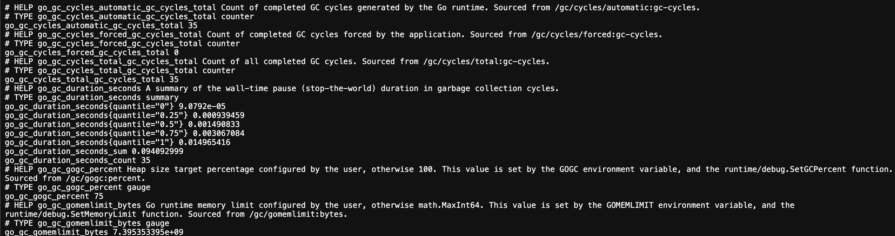
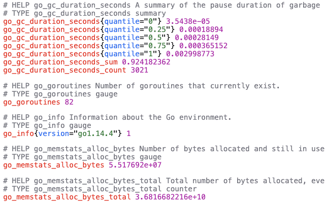

# 03 — 動手做：跑起第一個 Prometheus


在前兩章，我們聊了 monitoring 是什麼、Prometheus 的核心概念是什麼。這一章，我們要把它 **跑起來**。

但我們不會從零開始打字建檔——工作坊已經把完整的範例 stack 放在 `Prometheus/examples/` 裡了。這張會講從一個服務怎麼expose metrics 開始，走到 Prometheus 怎麼把它們抓下來、怎麼在 Web UI 畫成圖。

---

## 目錄

- [03 — 動手做：跑起第一個 Prometheus](#03--動手做跑起第一個-prometheus)
  - [目錄](#目錄)
  - [事前準備](#事前準備)
  - [Step 1：/examples 裡有什麼？](#step-1examples-裡有什麼)
  - [Step 2：啟動整個 stack](#step-2啟動整個-stack)
  - [Step 3：一個服務怎麼 expose metrics？](#step-3一個服務怎麼-expose-metrics)
    - [從 `/home` 製造流量](#從-home-製造流量)
    - [看 `/metrics` 的原始輸出](#看-metrics-的原始輸出)
    - [對照原始碼](#對照原始碼)
  - [Step 4：Prometheus 把這些 metrics 抓到哪去了？](#step-4prometheus-把這些-metrics-抓到哪去了)
    - [Targets 頁面](#targets-頁面)
    - [prometheus.yml](#prometheusyml)
  - [Step 5：用 PromQL 畫圖](#step-5用-promql-畫圖)
    - [Query 1：看誰還活著](#query-1看誰還活著)
    - [Query 2：每秒多少人訪問 /home？](#query-2每秒多少人訪問-home)
    - [Query 3：現在有幾個 active users？](#query-3現在有幾個-active-users)
    - [Query 4：主機的 CPU 使用率](#query-4主機的-cpu-使用率)
  - [到這邊我們有](#到這邊我們有)
  - [常見問題排解](#常見問題排解)
  - [小結與練習題](#小結與練習題)

---

## 事前準備

在 Docker workshop 中已經安裝了 Docker、Docker Compose、git。確認它們能正常使用：

```bash
docker --version
docker compose version
git --version
```

建議也裝一個瀏覽器擴充功能，讓 `/metrics` 的原始輸出比較好讀：

- [Prometheus Formatter Extension](https://chromewebstore.google.com/detail/jhfbpphccndhifmpfbnpobpclhedckbb?utm_source=item-share-cb)



裝之後有縮排、顏色、可以收折：



---

## Step 1：/examples 裡有什麼？

先用 `ls` 看一眼：

```
examples/
├── docker-compose.yml        # 把下面所有服務串在一起
├── app/                      # 一個示範用的 Go 服務，會 expose /metrics
│   ├── Dockerfile
│   ├── main.go
│   └── go.mod, go.sum
├── prometheus/
│   ├── prometheus.yml        # scrape 設定 + alerting 指向 alertmanager
│   ├── alert_rules.yml       # 告警規則（下一章會用到）
│   ├── alertmanager.yml      # Alertmanager 設定（下一章會用到）
│   └── secrets/              # Discord webhook 的 secret 放這裡（gitignored）
└── grafana/
    └── provisioning/         # Grafana data sources + dashboard 預載
```

這一章先講 `app/` 和 `prometheus/prometheus.yml`

---

## Step 2：啟動整個 stack

```bash
docker compose up -d
```

確認每個 service 都在跑：

```bash
docker compose ps
```

你應該看到 5 個 services：`app`、`prometheus`、`node-exporter`、`alertmanager`、`grafana`。如果有哪個不是 **running**，用 `docker compose logs <service-name>` 看一下。

> **Port 對照表**
>
> | 服務 | URL |
> |------|-----|
> | Go app | http://localhost:8088 |
> | Prometheus | http://localhost:9090 |
> | Node Exporter | http://localhost:9100 |
> | Alertmanager | http://localhost:9093 |
> | Grafana | http://localhost:3000 |

---

## Step 3：一個服務怎麼 expose metrics？

因為Prometheus 是 **pull-based** 的，它自己定時去每個服務的 `/metrics` endpoint 抓資料。那服務這端要怎麼準備這個 endpoint？我們從 `examples/app` 這個 Go 小程式開始看。

### 從 `/home` 製造流量

先製造一點流量，`/metrics` 才有東西可看：

```bash
for i in {1..10}; do curl -s http://localhost:8088/home; echo; done
```

### 看 `/metrics` 的原始輸出

打開 http://localhost:8088/metrics

這就是 **Prometheus exposition format**——純文字、一行一個 sample，前面的 `# HELP` 和 `# TYPE` 註解告訴 Prometheus 這個 metric 是做什麼的、是哪一種類型。

回頭對照第 2 章介紹過的四種 metric types：

| 在 `/metrics` 看到的 | 對應到 |
|---------------------|--------|
| `home_requests_total` | **Counter**（只會增加） |
| `active_users` | **Gauge**（上下都會動） |
| `http_request_duration_seconds_bucket` / `_sum` / `_count` | **Histogram**（分桶的分佈） |
| `http_request_summary_seconds` | **Summary**（client 端算好 quantile） |

### 對照原始碼

打開 `examples/app/main.go`，看一下 `NewMetrics` 函式（大約 30-65 行）。你會看到這幾種 metric 是怎麼被宣告出來的：

```go
httpRequestsTotal: prometheus.NewCounterVec(
    prometheus.CounterOpts{
        Name: "home_requests_total",
        Help: "Total number of requests and status to the /home endpoint.",
    },
    []string{"method", "status"},
),
```

然後在 `homeHandler` 裡，每次有人訪問 `/home`，這些 metric 就被更新一次：

```go
m.activeUsers.Inc()            // gauge +1
defer m.activeUsers.Dec()      // 離開時 gauge -1
m.httpRequestDuration.WithLabelValues("/home").Observe(duration)
m.httpRequestsTotal.With(prometheus.Labels{"method": r.Method, "status": "200"}).Inc()
```

最後在 `main` 裡，把 `/metrics` 這個 endpoint 掛上去：

```go
http.Handle("/metrics", promhttp.HandlerFor(reg, promhttp.HandlerOpts{}))
```

宣告 metric → 在 request 處理的地方更新它 → 把 `/metrics` endpoint 開出去。

---

## Step 4：Prometheus 把這些 metrics 抓到哪去了？

打開 http://localhost:9090。這是 Prometheus 自己的 Web UI。

### Targets 頁面

點上方導覽列的 **Status → Target health**。你會看到一張表，每一列是一個 Prometheus 正在 scrape 的 target：

- `prometheus` — Prometheus 自己（self-monitoring）
- `go_practice` — 剛剛那個 Go app
- `node` — Node Exporter（硬體指標）
- `alertmanager` — Alertmanager 自己的 metrics
- `demo` —  promlabs 的demo endpoint

每個 target 應該都是 **UP**（綠色）。如果 `go_practice` 是 DOWN，表示 Prometheus 連不到 app container——通常是網路設定或 service name 寫錯。

### prometheus.yml

打開 `examples/prometheus/prometheus.yml`：

```yaml
global:
  scrape_interval: 30s       # 每 30 秒去 scrape 一次
  evaluation_interval: 15s   # 每 15 秒評估一次 alert rules

rule_files:
  - "/alert_rules.yml"       # 告警規則檔的路徑

alerting:
  alertmanagers:
    - static_configs:
        - targets:
            - "alertmanager:9093"   # 告警要送去哪

scrape_configs:
  - job_name: "go_practice"
    static_configs:
      - targets:
          - "app:8088"                # 注意不是 localhost:8088

  - job_name: "node"
    static_configs:
      - targets:
          - "node-exporter:9100"
```

幾個細節：

- **`targets: "app:8088"`** 不是 `localhost:8088`——因為 Prometheus 和 app 都是 container，彼此用 Docker network 的 **service name** 通訊。
- **`scrape_interval: 30s`** 是Global預設值，個別 job 可以覆蓋。
- **`alerting:` 和 `rule_files:`** 下一章 Alertmanager 用的

---

## Step 5：用 PromQL 畫圖

回到 Prometheus UI 首頁（Graph 頁面）。左邊的輸入框就是 PromQL 查詢的地方。

### Query 1：看誰還活著

```promql
up
```

按 **Execute**，你會看到每個 target 一筆結果，`1` 代表 scrape 成功、`0` 代表失敗。切到 **Graph** 分頁可以看到時間軸上的走勢——理想狀況下應該是一條直直的 `1`。

### Query 2：每秒多少人訪問 /home？

再產生一波流量：

```bash
for i in {1..15}; do curl -s http://localhost:8088/home; done
```

然後在 Prometheus 查：

```promql
rate(home_requests_total[1m])
```

`home_requests_total` 是 counter（只會漲），直接看它沒意義——你會只看到一條持續往上爬的線。`rate(...[1m])` 算的是 **過去 1 分鐘內每秒的平均增長率**，這才是真正的「每秒請求數」。

> 這個「counter 一定要套 `rate()` / `irate()` / `increase()` 才有意義」

### Query 3：現在有幾個 active users？

```promql
active_users
```

這是 gauge，可以直接看。它大部分時候會是 0，因為 handler 進來時 +1、離開時 -1，而 handler 執行很快。想看它跳動，開另一個 terminal 跑個壓力測試：

```bash
# 10 個並行連線 30 秒
ab -c 10 -t 30 http://localhost:8088/home
# 沒有 ab 的話用這個也行：
# for i in {1..200}; do curl -s http://localhost:8088/home & done; wait
```

### Query 4：主機的 CPU 使用率

Node Exporter 的經典查詢：

```promql
(1 - avg by(instance) (rate(node_cpu_seconds_total{mode="idle"}[5m]))) * 100
```

拆開來看：
1. `node_cpu_seconds_total{mode="idle"}` — CPU 閒置時間（counter）
2. `rate(...[5m])` — 過去 5 分鐘的每秒變化率 = 每秒有多少秒是閒置的（0 到 1）
3. `avg by(instance)(...)` — 把所有 CPU 核心平均起來
4. `1 - ... ` — 非閒置比例 = 使用率
5. `* 100` — 轉成百分比


---

## 到這邊我們有

- 一個會 expose `/metrics` 的服務
- 一個把它抓下來、存進 TSDB 的 Prometheus
- 一個可以用 PromQL 查詢畫圖的 Web UI

但 Prometheus Web UI 的 Graph 很陽春，看完 query 就沒了，沒辦法長期觀察、沒辦法拼 dashboard；而且它只會「顯示」資料，不會「通知」你出事。

下一章 **Alertmanager**：當 CPU 超過 90% 撐了 5 分鐘，它會自動發 Discord 通知給你。

---

## 常見問題排解

**1. Port 被占用**

```
Error starting userland proxy: listen tcp4 0.0.0.0:9090: bind: address already in use
```

找出誰在用：

```bash
lsof -i :9090
# 或者：改 docker-compose.yml 的 ports 對應，例如 "9091:9090"
```

**2. `app` target 是 DOWN**

```bash
# 從 prometheus container 裡面 ping 一下 app
docker compose exec prometheus wget -qO- http://app:8088/metrics | head
```

如果上面這行也連不到，通常是 `app` container 沒起來，或 service name 寫錯。

**3. `/metrics` 打開是一片空白**

先進 `/home` 幾次。這個 Go app 的 metric 是 lazy registered 的——第一次有 request 進來前，某些 metric 根本還沒被登錄。

**4. 設定檔改了 Prometheus 沒反應**

Prometheus 不會自動 reload。兩種方式：

```bash
docker compose restart prometheus           # 重啟 container
docker compose kill -s SIGHUP prometheus    # 送 SIGHUP（不中斷服務）
```

改完後先用 `promtool` 驗語法再套用：

```bash
docker run --rm \
  -v "$PWD/prometheus/prometheus.yml:/etc/prometheus/prometheus.yml:ro" \
  -v "$PWD/prometheus/alert_rules.yml:/alert_rules.yml:ro" \
  --entrypoint promtool prom/prometheus:v3.11.2 \
  check config /etc/prometheus/prometheus.yml
```

---

## 小結與練習題

**本章重點回顧**

- 服務 expose metrics 的方式：用 client library 宣告 metric → 在程式邏輯裡更新 → 開 `/metrics` HTTP endpoint
- Prometheus exposition format：純文字、`# HELP` / `# TYPE` 註解 + `name{labels} value` 的 sample 行
- `prometheus.yml` 的核心是 `scrape_configs`，用 `job_name` 分組，target 在同一個 Docker 網路裡要用 **service name** 而不是 `localhost`
- Counter 查詢幾乎一定要套 `rate()` / `irate()` / `increase()`，Gauge 可以直接看


---

[← 上一章：Prometheus 核心概念](02-prometheus-fundamentals.md) ｜ [下一章：Alertmanager 告警系統 →](04-alerting.md)
