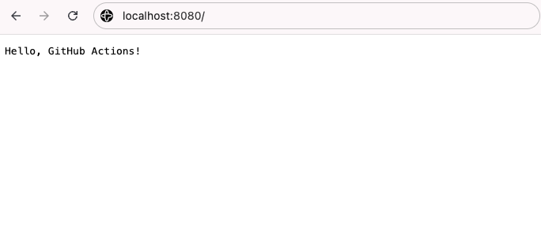

# 03 — Go 專案 CI Pipeline

Ocean 成功跑完第一個 Hello World workflow 後信心大增。Andrew 看到後問他：「那你能幫我的 Go 專案也設一個自動化測試嗎？每次 push 完都要手動跑 `go test`，我已經受夠了。」Ocean 想了想，決定動手試試。

## Table of Contents

- [學習目標](#學習目標)
- [範例專案介紹](#範例專案介紹)
- [完整 CI Workflow](#完整-ci-workflow)
- [逐段解說](#逐段解說)
- [小結與練習題](#小結與練習題)


## 學習目標

完成本章節後，你將能夠：

- 為 Go 專案建立一套包含 **lint、test、build** 的完整 CI pipeline
- 理解 **job 之間的依賴關係** 以及平行與序列執行的差異
- 知道如何用 **artifacts** 在 job 之間傳遞檔案
- 理解 `on: push` 和 `on: pull_request` 的差異


## 範例專案介紹

本章使用一個簡單的 Go HTTP API 伺服器作為範例，放在 `cicd/examples/sample-app/`：

```
cicd/examples/sample-app/
├── main.go            # HTTP server entry point
├── handler.go         # HTTP handler functions
├── handler_test.go    # Unit tests
├── go.mod             # Go module definition
├── Dockerfile         # Container image definition
└── .golangci.yml      # golangci-lint configuration
```

它提供三個 endpoint：

| Endpoint | Method | 功能 | 回傳範例 |
|----------|--------|------|---------|
| `/` | GET | 首頁歡迎訊息 | `Hello, GitHub Actions!`（純文字） |
| `/health` | GET | 健康檢查 | `{"status":"ok"}` |
| `/version` | GET | 版本資訊 | `{"version":"dev"}` |

並在 `handler_test.go` 中用 Go 標準函式庫的 `testing` 和 `net/http/httptest` 寫了單元測試。程式碼細節可以直接打開 `cicd/examples/sample-app/` 查看，這章的重點是幫它建立 CI pipeline。

### 在本機跑跑看

在開始建 CI 之前，先把這個服務在自己的電腦上跑起來，確認它可以正常運作：

```bash
cd cicd/examples/sample-app
go run .
```

伺服器會開在 `8080` port。打開瀏覽器到 [http://localhost:8080/](http://localhost:8080/)，應該會看到 `Hello, GitHub Actions!`：



也可以試試 `/health` 和 `/version` 兩個 endpoint。確認本機可以跑之後，按 `Ctrl+C` 停掉，接下來我們要做的就是讓 CI 自動幫我們驗證這個服務每次改動後還是能正常編譯、測試、運作。

## 完整 CI Workflow

接下來我們要為範例專案建立一個完整的 Go CI workflow。這個 workflow 會在每次 `push` 或 `pull_request` 到 `main` 時自動觸發，並依序完成三件事：

1. **Lint**：用 `golangci-lint` 檢查程式碼風格與潛在問題
2. **Test**：執行單元測試，產生覆蓋率報告並上傳成 artifact
3. **Build**：在 lint 與 test 都通過後，才編譯出 binary 並上傳

其中 `lint` 和 `test` 會平行執行以節省時間，`build` 則透過 `needs` 等待前兩個 job 成功後才啟動。整個流程會是這樣：

```
        ┌──────┐
        │ push │
        └───┬──┘
     ┌──────┴──────┐
     ▼             ▼
  ┌──────┐     ┌──────┐
  │ lint │     │ test │
  └───┬──┘     └───┬──┘
     └──────┬──────┘
            ▼
        ┌───────┐
        │ build │
        └───────┘
```

請在你的專案中建立 `.github/workflows/ci.yml`：

```yaml
name: Sample App CI

on:
  push:
    branches: [main]
    paths:
      - 'cicd/examples/sample-app/**'
      - '.github/workflows/sample-app-ci.yml'
  pull_request:
    branches: [main]
    paths:
      - 'cicd/examples/sample-app/**'
      - '.github/workflows/sample-app-ci.yml'

defaults:
  run:
    working-directory: cicd/examples/sample-app

jobs:
  lint:
    name: Lint
    runs-on: ubuntu-latest
    steps:
      - uses: actions/checkout@v4
      - uses: actions/setup-go@v5
        with:
          go-version: '1.24'
          cache-dependency-path: cicd/examples/sample-app/go.sum
      - name: Run golangci-lint
        uses: golangci/golangci-lint-action@v6
        with:
          version: latest
          working-directory: cicd/examples/sample-app

  test:
    name: Test
    runs-on: ubuntu-latest
    steps:
      - uses: actions/checkout@v4
      - uses: actions/setup-go@v5
        with:
          go-version: '1.24'
          cache-dependency-path: cicd/examples/sample-app/go.sum
      - name: Verify dependencies
        run: go mod verify
      - name: Run tests
        run: go test -v -race -coverprofile=coverage.out ./...
      - name: Show coverage
        run: go tool cover -func=coverage.out
      - name: Upload coverage
        uses: actions/upload-artifact@v4
        with:
          name: coverage-report
          path: cicd/examples/sample-app/coverage.out

  build:
    name: Build
    needs: [lint, test]
    runs-on: ubuntu-latest
    steps:
      - uses: actions/checkout@v4
      - uses: actions/setup-go@v5
        with:
          go-version: '1.24'
          cache-dependency-path: cicd/examples/sample-app/go.sum
      - name: Build binary
        run: go build -o bin/app .
      - name: Upload binary
        uses: actions/upload-artifact@v4
        with:
          name: app-binary
          path: cicd/examples/sample-app/bin/app
```

> 這份 workflow 實際放在 workshop repo 的 `.github/workflows/sample-app-ci.yml`（也同步一份在 `cicd/examples/sample-app/.github/workflows/ci.yml` 供參考）。因為 sample-app 是這個 workshop repo 底下的一個子目錄，裡面用到了幾個「子目錄專案」才需要的特殊設定：`paths` 過濾讓 workflow 只在 `cicd/examples/sample-app/**` 變動時觸發、`defaults.run.working-directory` 讓所有 `run:` 指令都跑在 sample-app 子目錄裡、`cache-dependency-path` 指向子目錄的 `go.sum`、artifact 的 `path:` 也要用 repo 相對路徑（因為 `upload-artifact` 不受 `working-directory` 影響）。如果你自己的 Go 專案 repo 就是以 Go 程式碼為根目錄，這些子目錄相關設定都可以拿掉，會更精簡。

## 逐段解說

### 觸發條件

```yaml
on:
  push:
    branches: [main]
  pull_request:
    branches: [main]
```

這個 workflow 會在兩種時機被觸發：程式碼 push 到 `main` 時，以及當有 PR 準備合併進 `main` 時。

兩者扮演的角色不同：`pull_request` 是合併前的品質檢查，目的是在修改進入 `main` 之前先攔下有問題的程式碼；`push` 則是合併後的最終驗證，確認實際進入 `main` 的版本仍然是健康的。兩者同時設定，就能同時兼顧「合併前的預防」與「合併後的驗證」。

此外，有一個容易被忽略的細節值得特別說明：當 `pull_request` 事件被觸發時，GitHub Actions 實際執行的並不是分支上的 commit，而是**將該分支模擬合併進 `main` 後所產生的 merge commit**。這樣的設計讓測試結果反映的是合併後的實際狀態，因此合併衝突或相容性問題能在 PR 階段就被及早發現。


> **先講一個共通點**：接下來三個 job（lint、test、build）的前兩個 step 都是 `actions/checkout` 和 `actions/setup-go`。這不是贅寫。**每個 job 都跑在全新的 runner 上**，前一個 job 下載的程式碼和安裝的 Go 到了下一個 job 就不存在了，所以每個 job 都要自己從零準備一次。也正是因為這個隔離性，跨 job 傳檔案才要靠 artifact（待會兒的 Test Job 會介紹）。

### Lint Job — 程式碼品質檢查

```yaml
lint:
  name: Lint
  runs-on: ubuntu-latest
  steps:
    - uses: actions/checkout@v4
    - uses: actions/setup-go@v5
      with:
        go-version: '1.24'
    - name: Run golangci-lint
      uses: golangci/golangci-lint-action@v6
      with:
        version: latest
```

**Linter** 是一種靜態分析工具，它不會執行你的程式碼，而是檢查程式碼的風格、潛在錯誤和不良寫法。[golangci-lint](https://golangci-lint.run/) 是 Go 生態系中最受歡迎的 linter，它整合了數十個 linter（如 `govet`、`errcheck`、`staticcheck` 等），只需要一個指令就能執行所有檢查。

這個 job 裡每個 step 做的事：

| 步驟 | 做什麼 | 為什麼需要 |
|------|--------|-----------|
| `actions/checkout@v4` | 下載 repository 程式碼 | Linter 需要讀取程式碼才能分析 |
| `actions/setup-go@v5` | 安裝 Go 1.24 | golangci-lint 需要 Go 環境 |
| `golangci-lint-action@v6` | 執行 golangci-lint | 檢查程式碼品質 |

其中 [golangci/golangci-lint-action](https://github.com/golangci/golangci-lint-action) 是社群維護的 Action，會自動下載並安裝 golangci-lint、快取執行結果，並在偵測到 `.golangci.yml` 時自動套用設定。`sample-app` 已經附了一份 `.golangci.yml`，所以會直接用那份設定。


### Test Job — 自動化測試

#### 什麼是「測試」？

簡單說，**測試（test）就是另一段你寫的程式，專門用來驗證你主要的程式碼是否如預期運作**。舉例來說，sample-app 裡的 `handler.go` 定義了 `/health` 這個 endpoint 會回傳 `{"status":"ok"}`，那對應的測試（在 `handler_test.go`）就會模擬一個 HTTP 請求打進這個 endpoint，檢查它真的回了 `200` 狀態碼和正確的 JSON 內容。如果之後有人不小心改壞 `handler.go`，測試就會失敗，CI 會立刻擋住這次改動。

Go 的測試不需要額外安裝框架，標準函式庫裡的 `testing` 套件就能寫，檔名以 `_test.go` 結尾就會被自動辨識成測試檔案。執行所有測試的指令是 `go test ./...`。

本章我們不深入教怎麼寫 Go 測試，只要知道**「CI 會自動跑 `go test`，測試沒過就不能合併」**這個概念，就足以理解下面的 workflow 在做什麼。

```yaml
test:
  name: Test
  runs-on: ubuntu-latest
  steps:
    - uses: actions/checkout@v4
    - uses: actions/setup-go@v5
      with:
        go-version: '1.24'
    - name: Run tests
      run: go test -v -race -coverprofile=coverage.out ./...
    - name: Show coverage
      run: go tool cover -func=coverage.out
    - name: Upload coverage
      uses: actions/upload-artifact@v4
      with:
        name: coverage-report
        path: coverage.out
```

#### `go test` 的各個 Flag

| Flag | 用途 | 說明 |
|------|------|------|
| `-v` | **Verbose** 詳細輸出 | 印出每個測試函式的名稱與結果，而不只是通過/失敗的摘要 |
| `-race` | **Race Detector** 競爭偵測 | 在測試時偵測 goroutine 之間的 data race，這是 Go 並行程式中常見的 bug |
| `-coverprofile=coverage.out` | **Coverage Profile** 覆蓋率報告 | 將測試覆蓋率資料輸出到 `coverage.out` 檔案 |
| `./...` | **所有套件** | 遞迴執行所有子目錄中的測試 |

#### 測試覆蓋率（Test Coverage）

**測試覆蓋率** 是衡量「你的測試涵蓋了多少程式碼」的指標。

```bash
# Example output of go tool cover -func
github.com/example/sample-app/handler.go:10:  handleRoot     100.0%
github.com/example/sample-app/handler.go:15:  handleHealth   100.0%
github.com/example/sample-app/handler.go:23:  handleVersion   80.0%
total:                                        (statements)   93.3%
```

- **100%** 表示該函式的每一行都被測試到了
- **80%** 表示有 20% 的程式碼路徑沒有被測試覆蓋
- 一般來說，核心業務邏輯建議達到 **80% 以上** 的覆蓋率

#### Artifact 上傳

```yaml
- name: Upload coverage
  uses: actions/upload-artifact@v4
  with:
    name: coverage-report
    path: coverage.out
```

這是我們第一次用到 **artifact**。

不同 job 在不同的 Runner 上執行，檔案系統互不相通，所以 job 之間如果要傳檔案就要靠 artifact。`upload-artifact` 會把檔案上傳到 GitHub，之後你可以：

1. 在 Actions 頁面手動下載（例如下載 coverage report 來看）
2. 在同一個 workflow 的另一個 job 用 `actions/download-artifact@v4` 把它取回來用

本章只用到第一種：把 coverage 和 binary 上傳，讓你可以到 Actions 頁面下載。未來 04 章的 deploy 流程要用到 binary 時，就會用 `download-artifact` 把 build job 上傳的那份取回來，不用重新編譯。

Artifact 預設保存 90 天，可以用 `retention-days` 自訂（最短 1 天，最長 90 天）。

#### 一個常見的加碼：`go mod verify`

Test job 還有一個 Go 開發者常順手加上的小檢查，放在 `go test` 之前：

```yaml
- name: Verify dependencies
  run: go mod verify
```

`go mod verify` 會比對本地 module cache 和 `go.sum` 裡記錄的 hash，確認依賴套件沒被偷改過。成本極低，有問題就早點發現。練習題會讓你動手把它加進 `ci.yml`。


### Build Job — 建置可執行檔

```yaml
build:
  name: Build
  needs: [lint, test]
  runs-on: ubuntu-latest
  steps:
    - uses: actions/checkout@v4
    - uses: actions/setup-go@v5
      with:
        go-version: '1.24'
    - name: Build binary
      run: go build -o bin/app .
    - name: Upload binary
      uses: actions/upload-artifact@v4
      with:
        name: app-binary
        path: bin/app
```

#### `needs` 關鍵字 — Job 依賴關係

```yaml
needs: [lint, test]
```

`needs` 用來定義 **job 之間的執行順序**：

- **沒有 `needs`** 的 job（如 `lint` 和 `test`）會 **平行執行**，同時開始
- **有 `needs`** 的 job（如 `build`）會 **等待** 指定的 job 全部完成後才開始
- 如果 `needs` 中的任何一個 job **失敗**，這個 job **不會執行**

#### 為什麼 Build 要等 Lint 和 Test 通過？

想想看：如果程式碼有 lint 錯誤或測試失敗，我們還需要花時間去 build 嗎？

答案是 **不需要**。既然程式碼品質有問題，就應該先修好再建置。這樣可以：

1. **節省 CI 資源**：不浪費時間在必然無用的建置上
2. **明確的失敗訊號**：開發者知道問題出在 lint 或 test，而不是 build
3. **邏輯上的正確性**：只有品質通過檢查的程式碼才值得建置

Build 產出的 binary 同樣用 `upload-artifact` 上傳，後續的 deploy job 或 release workflow 就可以直接取用這份 binary，不用重新編譯。

> **關於快取**：`actions/setup-go@v5` 偵測到 `go.sum` 時會自動快取 Go modules，後續執行只要 `go.sum` 沒變就會直接用快取，不用額外設定。

#### 延伸：Release 自動化

同樣是從 binary 出發，再往前一步就會遇到 **Release**：當專案穩定後，你會希望把某個特定版本「標記」起來發佈給使用者。做法是用 **Semantic Versioning**（例如 `v1.2.3`，MAJOR 代表破壞性變更、MINOR 代表新功能、PATCH 代表 bug 修正）搭配 **Git Tag** 來標記版本，再透過 `on: push: tags: ['v*']` 觸發一個 release workflow，自動建置產物並建立 GitHub Release。本工作坊不展開細節，有興趣可以查閱 [softprops/action-gh-release](https://github.com/softprops/action-gh-release)。

## 小結與練習題

這一章你為一個真正的 Go 專案建起了完整的 CI pipeline：用 `golangci-lint` 檢查程式碼、用 `go test -race` 跑單元測試並收集 coverage、再編譯出 binary，並透過 `needs` 讓 lint 和 test 平行執行、build 等前兩者都通過才啟動。你也認識了 `upload-artifact` 如何在 job 之間傳遞產物，並理解 `on: push` 搭配 `on: pull_request` 如何兼顧「合併前預防」與「合併後驗證」。下一章我們會把這支 binary 實際部署到雲端，讓整個 CI/CD 流程完整串起來。

### 本章重點回顧

- 一個完整的 Go CI pipeline 通常包含 **Lint → Test → Build** 三個階段
- 使用 `needs` 定義 job 之間的依賴關係，`lint` 和 `test` 平行執行，`build` 等它們都通過才執行
- **golangci-lint** 是 Go 最受歡迎的 linter 工具，可透過 `golangci-lint-action` 在 CI 中使用
- `go test -v -race -coverprofile=coverage.out ./...` 是標準的 CI 測試指令
- **Artifacts** 用來在不同 job 之間傳遞檔案（例如把 binary 從 build job 傳給 deploy job）
- 同時設 `on: push` 和 `on: pull_request` 可以兼顧「合併前預防」和「合併後驗證」

### 練習題

完成以下練習來鞏固本章所學：

[練習二：CI Pipeline 實戰練習](exercises/02-ci-pipeline.md)

[← 上一章：GitHub Actions 基礎](02-github-actions-basics.md) ｜ [下一章：部署到雲端平台 →](04-deployment.md)
